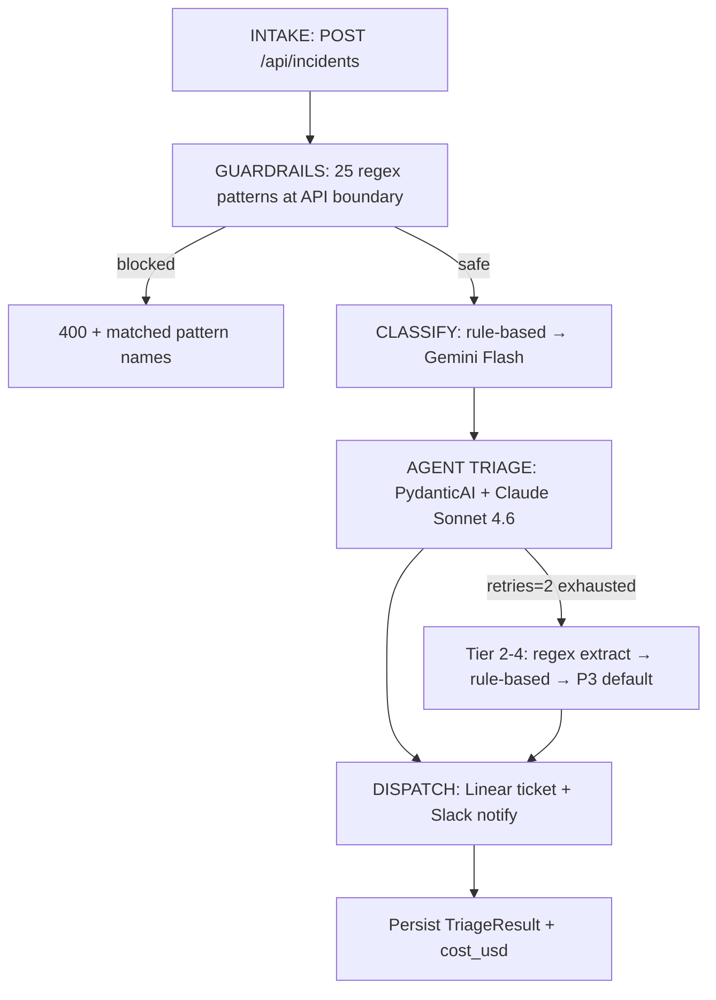

# Agent Documentation

## Agent Design

Pattern A (Single Agent + Deterministic Pipeline) from `arch-ref-lib` Tier 9. The agent is one premium-model call wrapped by a deterministic classify → triage → dispatch pipeline. Structured output is mechanically enforced (V1 — Enforce Output Structure) via PydanticAI's `output_type` rather than trusted prompt instructions.

**Source:** [app/agent/classify.py](../app/agent/classify.py), [app/agent/triage.py](../app/agent/triage.py), [app/agent/triage_agent.py](../app/agent/triage_agent.py), [app/agent/pipeline.py](../app/agent/pipeline.py), [app/agent/prompts.py](../app/agent/prompts.py)

### Pipeline stages

`INTAKE → GUARDRAILS → CLASSIFY → TRIAGE → DISPATCH` — `run_triage_pipeline(incident_id, incident)` orchestrates the final three stages (guardrails run at the API boundary per D1; see Safety section).



Guardrails are NOT re-run inside the pipeline (D1 — one trust boundary). The 4-tier fallback chain (retries → regex → rule → hardcoded P3) guarantees the pipeline never crashes and never returns empty — U4 Enforce Output Structure Mechanically at runtime, not just at type level.

| Stage | Module | Purpose | Model |
|---|---|---|---|
| 3. CLASSIFY | `app/agent/classify.py` | Cheap severity + category label. | Gemini Flash (V3 — cheap model for classification). MVP uses rule-based keywords. |
| 4. AGENT (TRIAGE) | `app/agent/triage_agent.py` + `app/agent/triage.py` | Full `TriageResult`: severity, service, hypothesis, confidence, mitigation steps, relevant files. | `anthropic:claude-sonnet-4-6` (V3 — premium for reasoning). |
| 6. DISPATCH | `app/integrations/dispatcher.py` | Create ticket + notify. See Integrations. | — |

### Structured outputs

Two Pydantic models enforce shape mechanically:

- `Classification` — `severity` (str: `critical`/`high`/`medium`/`low`), `category`, `confidence`, `reasoning`.
- `TriageResult` (V2 canonical schema) — `severity: Literal["P0".."P4"]`, `affected_service: str`, `root_cause_hypothesis: str`, `confidence: float = Field(ge=0.0, le=1.0)`, `mitigation_steps: list[str]`, `relevant_files: list[str]`.

Output shape cannot drift — the model never sees a "return JSON like this" instruction, only the `output_type`. Ill-formed output triggers PydanticAI retry.

### Triage agent (`triage_agent.py`)

```python
triage_agent: Agent[None, TriageResult] = Agent(
    "anthropic:claude-sonnet-4-6",
    output_type=TriageResult,
    retries=2,
    system_prompt=TRIAGE_SYSTEM_PROMPT,
)
```

- **Model pin:** exact `claude-sonnet-4-6` id. Version drift silently changes cost, latency, and calibration — do not swap without a V4 measurement run.
- **`retries=2`** is tier 1 of the 4-tier fallback chain. Tiers 2–4 (regex-extract → rule-based → hardcoded P3-to-SRE safe default) land in Phase 3a/3b via a wrapper in this module.
- `ANTHROPIC_API_KEY` is read from process env by PydanticAI's Anthropic provider. Missing key fails at call time, not construction time — caught by the Phase 3 wrapper.
- The rule-based stub in `triage.py:triage_incident` maps `Classification.severity` → `P0..P3` via `_CLASSIFY_TO_SEVERITY` and returns a safe default with generic mitigation steps. Still used by Phase 2 tests.

### Pipeline (`pipeline.py`)

`run_triage_pipeline` chains CLASSIFY → AGENT → DISPATCH with structured logging per stage (`classified`, `triaged`, `dispatched` events bound to `incident_id`). Returns `{"status": "completed", "classification": ..., "triage": ...}` on success; the API-layer background task consumes that dict and translates to DB state.

Guardrails are intentionally NOT re-run inside the pipeline (D1 — single trust domain; duplication = drift, not defense-in-depth). If a second caller is added, move the check into this function rather than duplicating it.

## Tools

<!-- Document @agent.tool decorated functions here -->

## Prompts

<!-- Document system prompts and prompt engineering decisions here -->

## Safety

Guardrails run at the API trust boundary (`app/api/main.py` — the single caller today). Pre-compiled regex scan, <5ms, fail-closed — block on any match.

**Source:** [app/agent/guardrails.py](../app/agent/guardrails.py)

### `check_input_safety(text) → SafetyResult`

`SafetyResult` is a `TypedDict`:

```python
{
    "safe": bool,              # len(matched) == 0
    "matched": list[str],      # pattern names that fired (for observability)
    "sanitized": str,          # control-chars stripped, >=3 newlines collapsed to 2
    "warning": str | None,     # length over DESCRIPTION_MAX_CHARS (8000) — warn, not block
}
```

### Pattern set (25 patterns)

Each pattern is a `(name, compiled_regex)` tuple so the matched name is emitted in logs and the 400 response — ops can see *which* attack is heating up this week, not just "blocked".

| Group | Patterns |
|---|---|
| Classic injection (15) | `ignore_previous`, `role_impersonation`, `system_prompt_probe`, `xml_role_tags`, `admin_mode`, `override_safety`, `jailbreak`, `pretend`, `act_as`, `forget_all`, `new_instructions`, `disregard`, `bypass_filter`, `reveal_prompt`, `ask_system_prompt` |
| Role separators | `role_separator_human` (`\n\nHuman:`), `role_separator_assistant` (`\n\nAssistant:`) |
| Token markers | `token_marker_im` (`<\|im_start\|>`), `token_marker_system` (`<\|system\|>`), `token_marker_bracket` (`[SYSTEM]`) |
| Emphasis bypass | `emphasis_bypass` (`IMPORTANT: ignore…`) |
| SQL injection | `sql_drop`, `sql_union` |
| Code execution | `code_import`, `code_eval`, `code_exec` — each requires a string-literal arg (`\s*\(\s*['"]`) so legitimate stack traces like `eval() raised TypeError` do NOT trigger |

Patterns are `re.IGNORECASE`. Set is versioned in code (not hot-reloaded) — shipping a new pattern requires a deploy.

### Sanitization

`_sanitize()`:
1. Removes ASCII control chars except `\n` / `\t` (`[\x00-\x08\x0b\x0c\x0e-\x1f\x7f]`).
2. Collapses 3+ consecutive newlines to 2.

Run BEFORE pattern matching so control-char stuffing can't slip past regex boundaries. Sanitized text is the version persisted to the DB and fed into the LLM — the raw attacker text never reaches downstream.

### Length handling

`DESCRIPTION_MAX_CHARS = 8000`. Longer inputs produce a `warning` string but `safe=True` stays true — length is a cost signal, not an attack. The warning surfaces in logs for future budget tuning.

### Known limitation

Pattern set is unversioned. Ops can't correlate "matches of `jailbreak` dropped after 04-21 deploy" unless the commit SHA is co-logged. Versioning is a known gap (see `docs/architecture-patterns.md` input-guardrails section).

## Context Engineering

<!-- Document service maps, retrieval strategy, search scoping here -->
