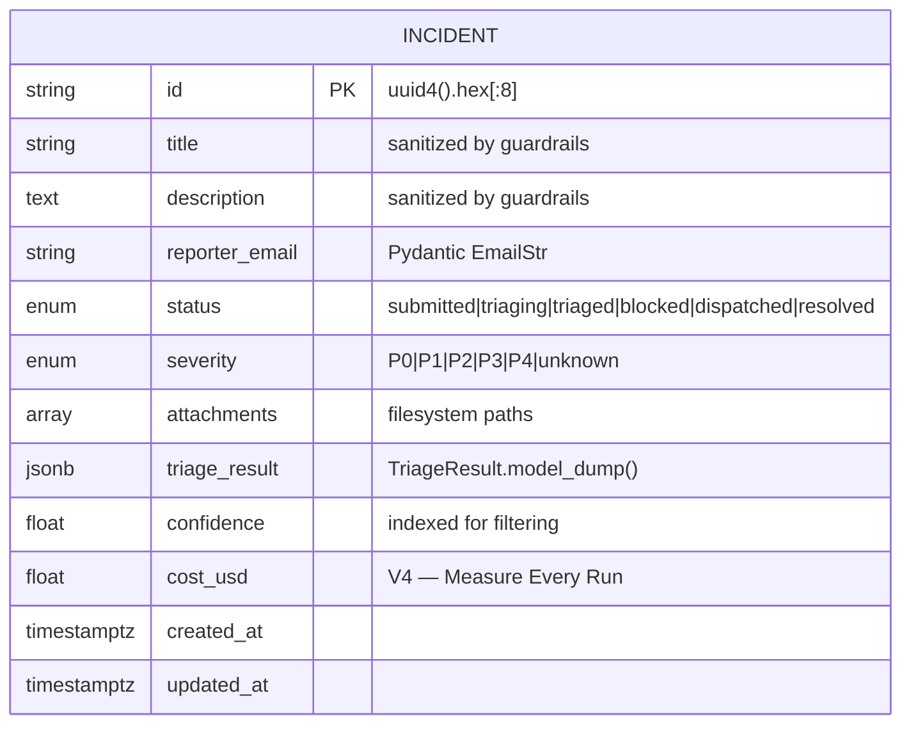
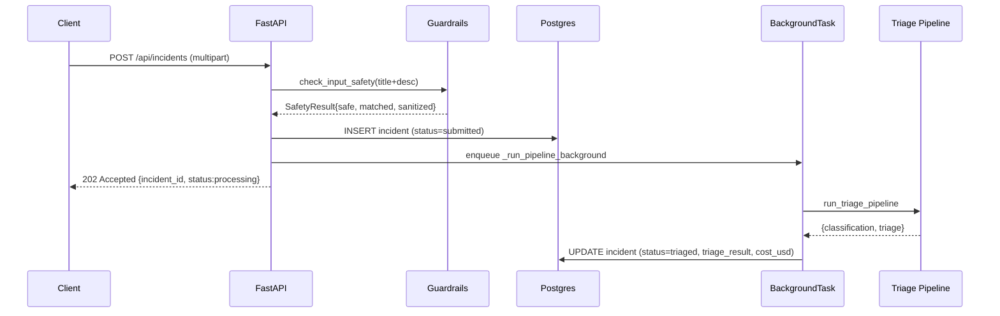
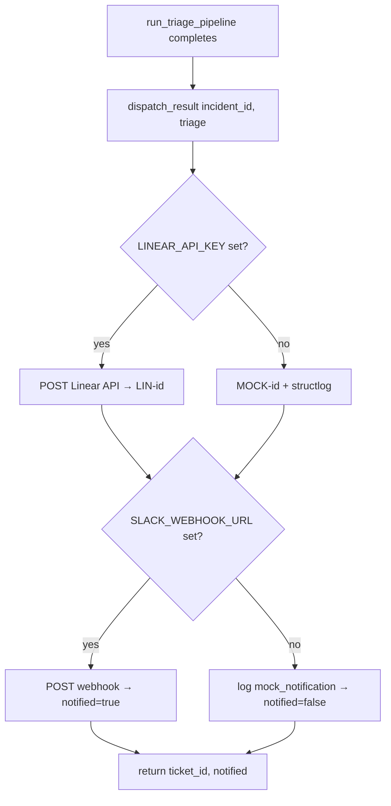

# Architecture

## Data Model

Single-table design for MVP. All incident state lives in `incidents` (PostgreSQL). Triage output is stored as JSONB rather than normalized — the `TriageResult` shape is young and still evolving; JSONB keeps migrations cheap until the shape settles.

**Source:** [app/db/models.py](../app/db/models.py), [app/db/config.py](../app/db/config.py), [app/db/repository.py](../app/db/repository.py), [alembic/versions/001_create_incidents_table.py](../alembic/versions/001_create_incidents_table.py)

Single entity today — no FKs. `triage_result` stays JSONB until the shape settles (expected: Phase 4+). Cardinality boundary lives on the JSONB key set, not a relational join.

### `incidents` table

| Column | Type | Notes |
|---|---|---|
| `id` | `String(32)` PK | 8-hex-char slug from `uuid4().hex[:8]` |
| `title` | `String(500)` | post-guardrail sanitized |
| `description` | `Text` | post-guardrail sanitized |
| `reporter_email` | `String(255)` | validated via Pydantic `EmailStr` before insert |
| `status` | `Enum(IncidentStatus)` | `submitted` → `triaging` → `triaged` / `blocked` / `dispatched` / `resolved` |
| `severity` | `Enum(IncidentSeverity)` | `P0`/`P1`/`P2`/`P3`/`P4`/`unknown`; `unknown` default until triage completes |
| `attachments` | `ARRAY(String)` nullable | filesystem paths under `uploads/` |
| `triage_result` | `JSONB` nullable | full `TriageResult.model_dump()` after triage |
| `confidence` | `Float` nullable | copied from triage result for indexed filtering |
| `cost_usd` | `Float` nullable | pipeline cost per V4 (Measure Every Run) |
| `created_at` / `updated_at` | `DateTime(tz=True)` | server-default `now()`, `updated_at` auto-updated |

### Access layer

- **Engine setup** lives in `app/db/config.py`. Global `_engine` + `_session_factory` are initialized once at FastAPI lifespan startup (`init_db()`) and disposed on shutdown (`close_db()`). Raises on unit-test misuse if `get_session_factory()` is called before init.
- **Repository functions** are plain async functions in `app/db/repository.py` — no ORM session leaks past function boundary. Pattern: grab factory → open session → commit → refresh → return detached instance.
- Operations: `create_incident`, `get_incident`, `update_incident(**fields)`, `list_incidents(status=?, limit=50)`. `update_incident` uses `setattr` for partial updates — caller owns field correctness.

### Migrations

Alembic, async-aware. Version `001` creates the table with PG `Enum` types for `status` / `severity` and disposes them on downgrade. New schema changes land as new revision files under `alembic/versions/`.

## API Contracts

<!-- Document Pydantic request/response schemas here -->

## API Endpoints

FastAPI app mounted at module `app.api.main:app`. Lifespan manager initializes DB on startup and creates `uploads/` directory. Structured logging via `structlog`.

**Source:** [app/api/main.py](../app/api/main.py)

Acceptance and processing run on opposite latency clocks — the 202 returns in ~5ms so the connection isn't held hostage by the LLM round-trip. See [docs/wells/3-api-layer.md](wells/3-api-layer.md) T2 for the full rationale.

| Method | Path | Purpose |
|---|---|---|
| `GET` | `/health` | Liveness probe. Returns `{"status": "ok"}`. |
| `POST` | `/api/incidents` | Submit incident for triage. **Returns `202 Accepted`** + `incident_id`. Pipeline runs in `BackgroundTasks` — the HTTP connection is not held hostage by the LLM round-trip. |
| `GET` | `/api/incidents` | List incidents. Optional `?status=` filter + `?limit=` (default 50). Most-recent first. |
| `GET` | `/api/incidents/{incident_id}` | Fetch one incident. 404 if unknown. |

### `POST /api/incidents` — submission flow

Multipart form-data (not JSON) because of file attachments. Form fields: `title`, `description`, `reporter_email`, `severity_hint` (default `auto-detect`, must be in `{P0..P4, auto-detect}`), plus repeated `files`.

Order of operations — each step is a hard gate; fail-closed with `400`:

1. **Email format** — Pydantic `EmailStr` via `TypeAdapter`.
2. **Guardrails** (`app/agent/guardrails.check_input_safety`) on `title` + `description`. Blocks when any of the 25 regex patterns fire; the matched pattern names go back in the `detail` message (observability over opaque block).
3. **Sanitized text** from the guardrail result replaces the originals before persistence.
4. **`severity_hint` allowlist** — explicit `VALID_SEVERITY_HINTS` set check.
5. **File uploads** — per file: MIME-allowlist check (`ALLOWED_MIMES`), 10MB size cap, magic-byte verification. `text/plain` and `application/json` are validated by decoding/parsing attempt, not by prefix. Blocking file I/O runs off the event loop via `asyncio.to_thread`.
6. **Persist** with `uuid4().hex[:8]` id, then enqueue the pipeline in `BackgroundTasks`.
7. **Return** `{incident_id, status: "processing"}` with `202`.

Background task (`_run_pipeline_background`):

- Mark `status=triaging`.
- Run `run_triage_pipeline` → on `"completed"` map `Classification.severity` → `IncidentSeverity` via `SEVERITY_MAP` (`critical`→P0, `high`→P1, …), dump `TriageResult` to JSONB, mark `status=triaged`.
- On `"blocked"` mark `status=blocked`. On any exception, log via `structlog.exception()` and leave status as `triaging` (exception is visible in logs, the DB row is not rewritten).

### `GET /api/incidents` / `GET /api/incidents/{id}`

Return `IncidentDetail` — explicit Pydantic projection over the ORM row, surfacing `triage_result` (JSONB), `confidence`, `cost_usd`, and ISO-formatted timestamps. The projection is explicit so enum values are serialized as their `.value` strings and `created_at.isoformat()` is always set.

## Integrations

Outbound adapters live in `app/integrations/`. Each integration has a **real implementation + mock fallback** keyed off the presence of its API secret — pipeline runs without any integration configured (CI / local dev).

**Source:** [app/integrations/dispatcher.py](../app/integrations/dispatcher.py)

Every integration follows the same real-vs-mock pattern keyed on its own env var — the deterministic-pipeline contract (every stage produces a result) holds even with zero external services wired up.

### `dispatch_result(incident_id, triage)` — Stage 6 (DISPATCH)

Input: triage `TriageResult`. Output: `{"ticket_id": str, "notified": bool}`.

| Env var set? | Behavior |
|---|---|
| `LINEAR_API_KEY` | Real Linear ticket via `_create_linear_ticket` → `LIN-{incident_id}`. |
| unset | Mock ticket `MOCK-{incident_id}`, logged via `structlog`. |
| `SLACK_WEBHOOK_URL` | Real Slack webhook via `_send_slack_notification`. Sets `notified=true`. |
| unset | Log `mock_notification` event. `notified=false`. |

Pipeline calls `dispatch_result` once per completed triage — see [app/agent/pipeline.py](../app/agent/pipeline.py).

Other planned adapters (Resend for email, additional webhooks) follow the same real-vs-mock keyed-on-env pattern. Keeps deterministic-pipeline contract: every stage produces a result, even with zero external services wired up.
