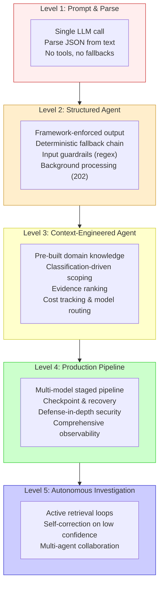
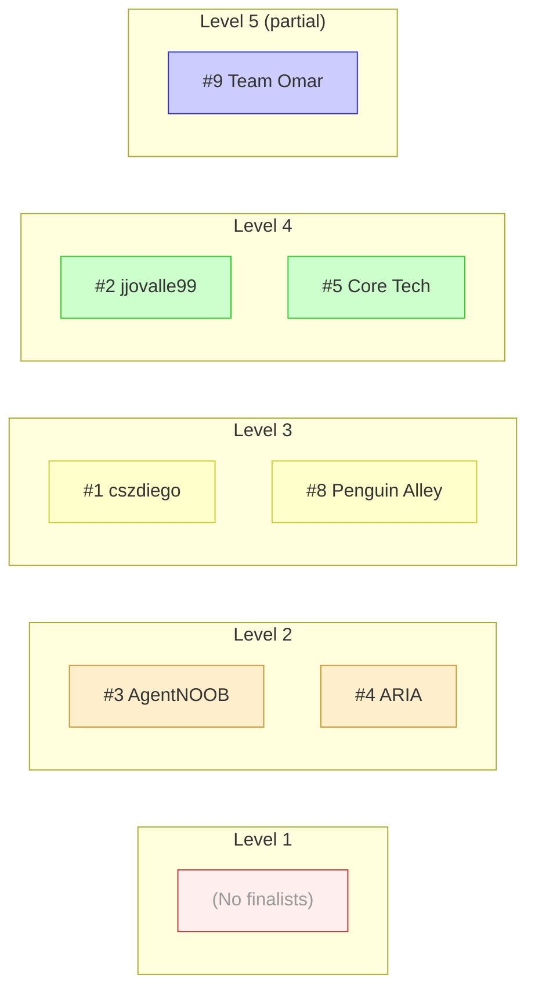
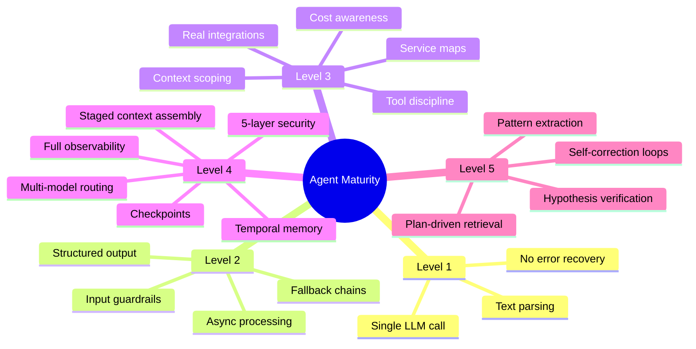

# 000 — Agent Engineering Maturity Model: Overview

**Source**: Analysis of 12 SRE triage agents (11 finalists + 1 submission), AgentX Hackathon 2026
**Purpose**: A framework for evaluating and improving AI agent implementations
**Reading order**: Start here, then follow the level docs (002-006) in order

---

## What Is This?

The Agent Engineering Maturity Model is a 5-level framework distilled from analyzing 12 production-intent agent implementations. Each level represents a distinct leap in reliability, cost-efficiency, and autonomy.

The model is **additive** — each level builds on the previous. You don't skip levels; you climb them.

## The Staircase

## Where the Finalists Landed

**Key observation**: No finalist was at Level 1. The minimum bar for a competitive agent is Level 2. The winners operated at Level 3-4. No one fully achieved Level 5.

## The Capability Map

Each level introduces specific capabilities. Here's what unlocks at each stage:

## Document Map

| Doc | Title | What You'll Learn |
|-----|-------|-------------------|
| [001](001-architecture-taxonomy.md) | Architecture Taxonomy | The 4 architecture patterns and when to use each |
| [002](002-level-1-prompt-and-parse.md) | Level 1: Prompt & Parse | The baseline — what to move past quickly |
| [003](003-level-2-structured-agent.md) | Level 2: Structured Agent | Your first real agent — output enforcement + safety |
| [004](004-level-3-context-engineered.md) | Level 3: Context-Engineered | The quality leap — controlling what the LLM sees |
| [005](005-level-4-production-pipeline.md) | Level 4: Production Pipeline | Multi-model, multi-stage, production-grade |
| [006](006-level-5-autonomous-investigation.md) | Level 5: Autonomous Investigation | The frontier — agent-driven exploration |
| [007](007-beyond-level-5.md) | Beyond Level 5 | Emerging patterns not yet observed in production |
| [008](008-anti-patterns.md) | Anti-Patterns | What NOT to do — categorized by level |
| [009](009-implementation-roadmap.md) | Implementation Roadmap | Step-by-step guide to climbing the levels |

## How to Use This

**If you're building your first agent**: Read 001, then 002-003. Implement Level 2 before anything else.

**If you're improving an existing agent**: Find your current level, read the next level doc, and implement the capabilities in order.

**If you're evaluating agents**: Use the maturity model to score implementations. The level grid in each doc provides a checklist.

---

*Next: [001 — Architecture Taxonomy](001-architecture-taxonomy.md)*
