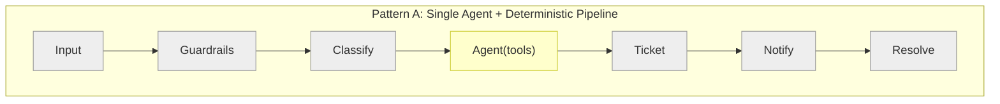
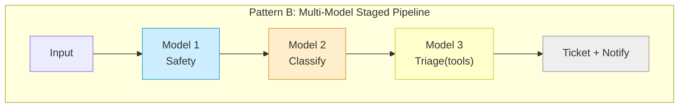
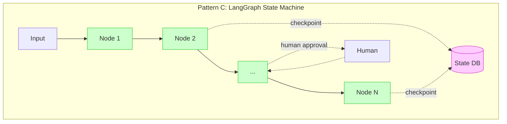
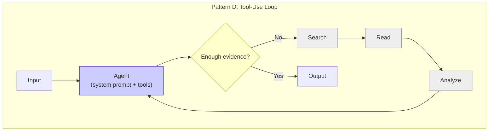
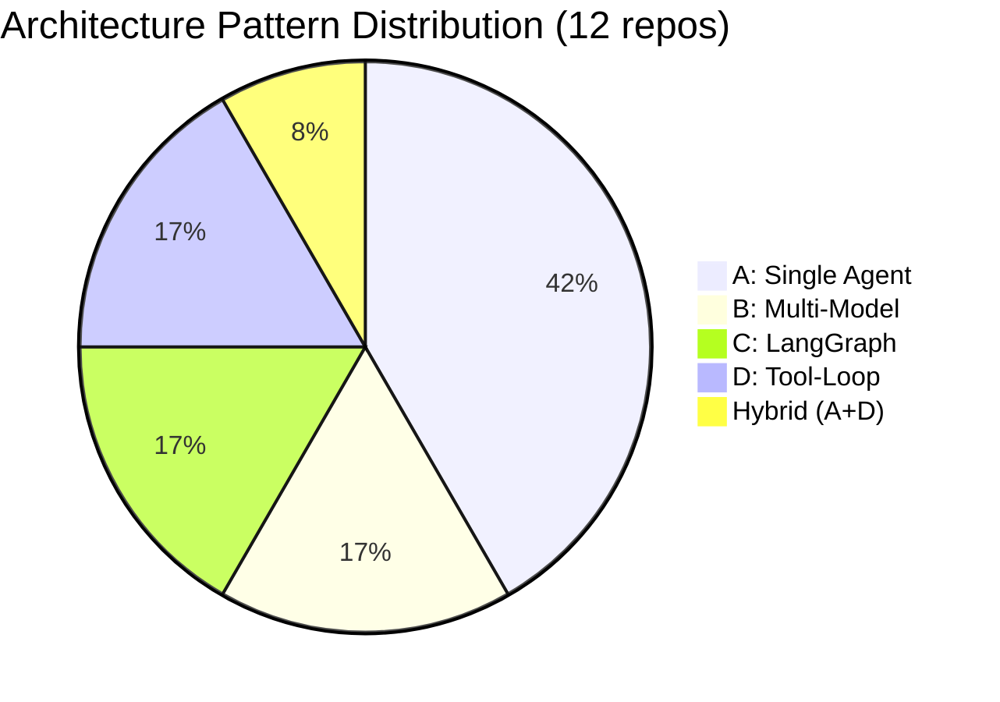
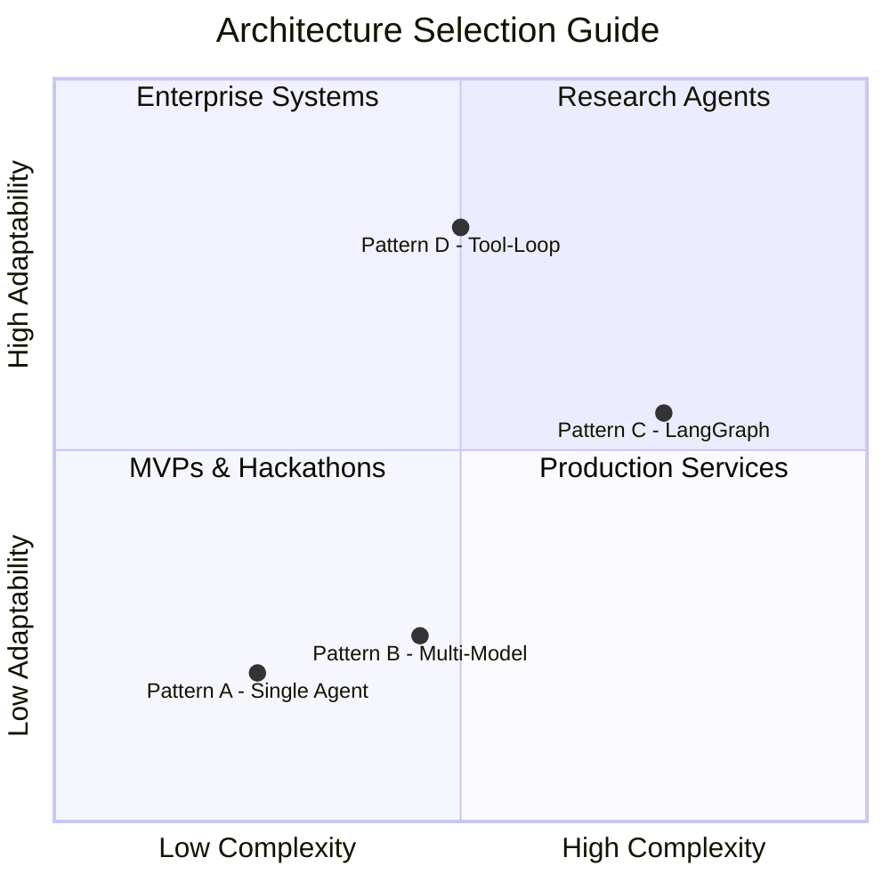
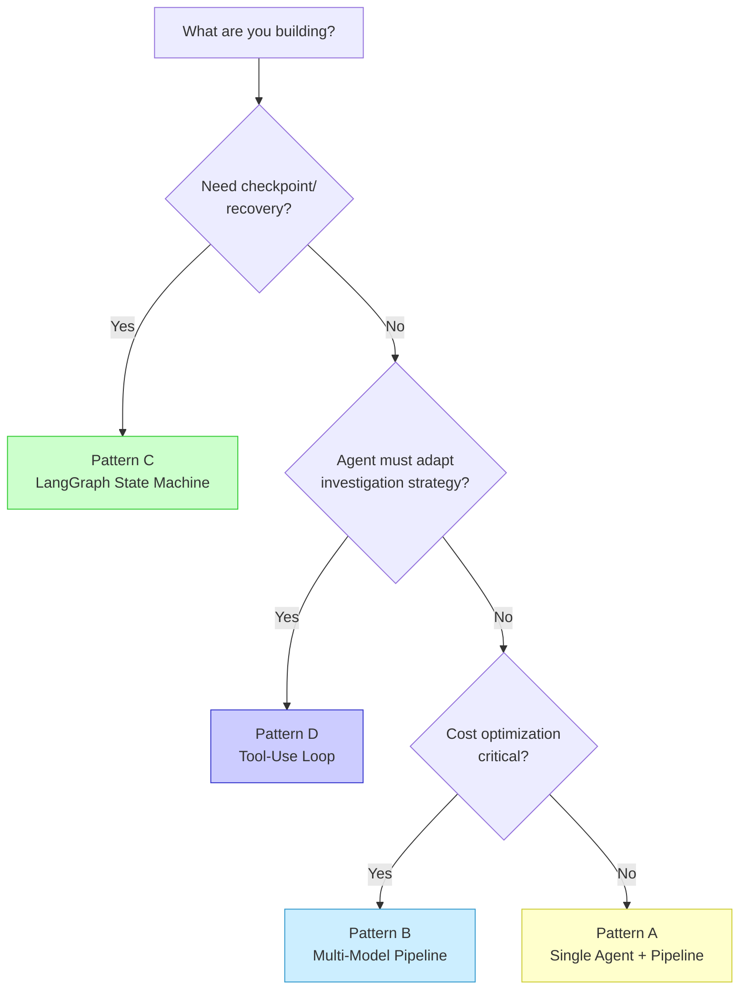

# 001 — Architecture Taxonomy: 4 Patterns for Agent Systems

**Context**: Before discussing maturity levels, understand the 4 architecture patterns observed across 12 agent implementations. Architecture choice is independent of maturity level — you can implement any pattern at any level.

---

## The 4 Patterns at a Glance

## Who Used What

| Pattern | Teams | Notable Implementation |
|---------|-------|----------------------|
| **A** Single Agent | #1, #3, #4, #11, Us | #1 (PydanticAI + 202 Accepted + SSE) |
| **B** Multi-Model | #2, #8 | #2 (5 models, $0.007/incident) |
| **C** LangGraph | #5 (10 nodes), #9 (13 nodes) | #5 (DB transaction per stage) |
| **D** Tool-Loop | #11 (max 8 iter), #9 (active retrieval) | #9 (Codex-inspired plan-search-verify) |

## Decision Matrix

### When to Choose Each

| Factor | A: Single Agent | B: Multi-Model | C: LangGraph | D: Tool-Loop |
|--------|----------------|----------------|--------------|--------------|
| **Latency** | 5-15s | 10-30s | 15-60s | 30-180s |
| **Cost/incident** | $0.01-0.05 | $0.005-0.01 | $0.02-0.05 | $0.02-0.10 |
| **Complexity** | Low | Medium | High | Medium |
| **Predictability** | High | High | High | Low |
| **Adaptability** | Low | Low | Medium | High |
| **Best for** | MVP, hackathon | Production cost-opt | Enterprise audit | Research, deep analysis |

### The Decision Flowchart

## Key Insight

**Architecture choice is not maturity.** A Level 4 implementation with Pattern A (single agent) beats a Level 2 implementation with Pattern C (LangGraph). Don't reach for complex architectures to compensate for missing fundamentals. Start with Pattern A, add sophistication as needed.

The #1 finalist won with Pattern A. The #2 finalist was most innovative with Pattern B. Pattern C and D add value only when you need checkpoint recovery or autonomous investigation.

---

*Previous: [000 — Overview](000-overview.md) | Next: [002 — Level 1: Prompt & Parse](002-level-1-prompt-and-parse.md)*
