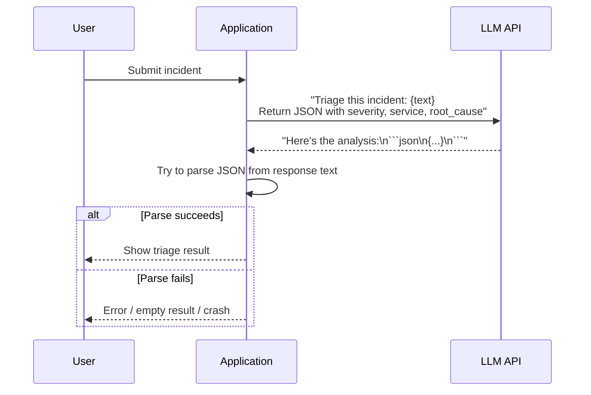
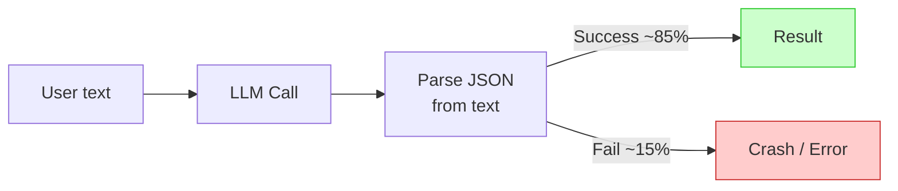
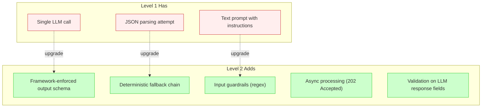

# 002 — Level 1: Prompt & Parse

**The baseline.** This is where everyone starts — and where you should leave quickly.

---

## What Level 1 Looks Like

## Characteristics

| Capability | Level 1 Status |
|------------|---------------|
| Output format | Hope the LLM returns valid JSON |
| Error handling | Crash or return empty on parse failure |
| Input safety | None — raw user text goes to LLM |
| Tools | None — LLM reasons from prompt text only |
| Processing | Synchronous — user waits for full response |
| Cost tracking | None |

## The Core Problem

At Level 1, roughly **15% of responses** will fail to parse correctly. The LLM might:
- Wrap JSON in markdown code fences
- Add explanatory text before/after the JSON
- Return partially valid JSON (trailing commas, single quotes)
- Hallucinate field names not in your prompt
- Return a completely different structure than requested

There is no fallback. When parsing fails, the user gets nothing.

## Why Nobody Stayed Here

None of the 12 analyzed implementations operated at Level 1. Even the simplest submissions had at least:
- Some form of structured output enforcement
- Basic input validation
- Background processing

This level exists as a reference point — it's where a "make the LLM do it" prototype starts. The gap between Level 1 and Level 2 is the difference between a demo that works sometimes and one that works reliably.

## What Level 1 Is Missing

## The Upgrade Path

Moving from Level 1 to Level 2 requires 3 changes:

1. **Enforce output schema** — Use PydanticAI `output_type` or Claude's `tool_choice` with a schema. Stop hoping the LLM cooperates.

2. **Add a fallback chain** — When the schema validation fails, retry once, then extract JSON with regex, then fall back to rule-based defaults. Never crash.

3. **Add input guardrails** — Compile 10-15 regex patterns (SQL injection, prompt injection, code execution). Run before any LLM call. Cost: <5ms.

Estimated effort: **2-4 hours** for a competent developer with framework experience.

---

*Previous: [001 — Architecture Taxonomy](001-architecture-taxonomy.md) | Next: [003 — Level 2: Structured Agent](003-level-2-structured-agent.md)*
