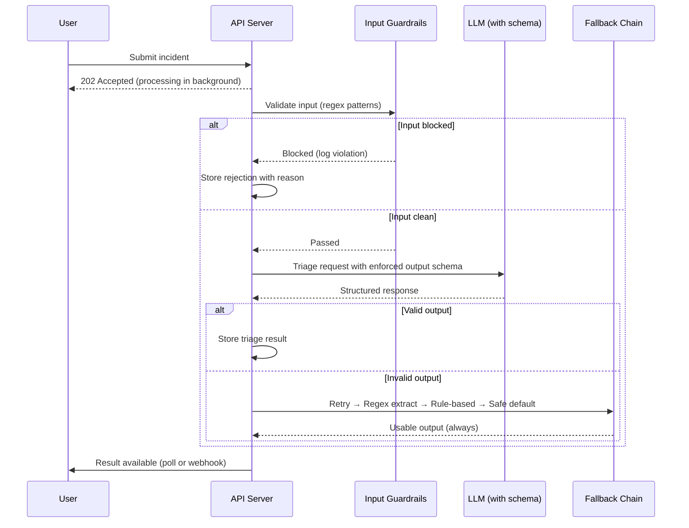
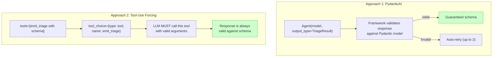
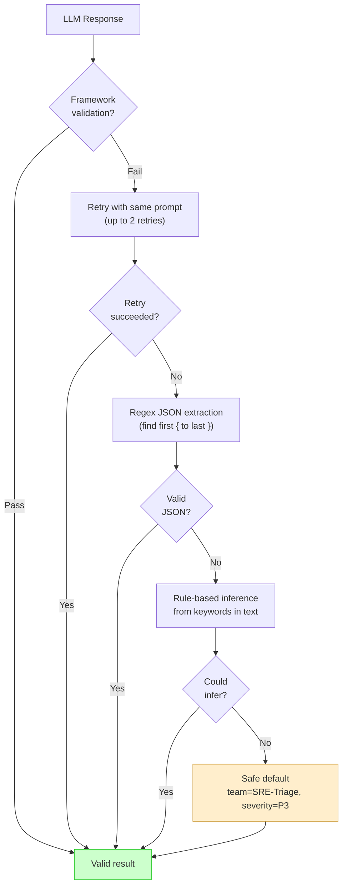
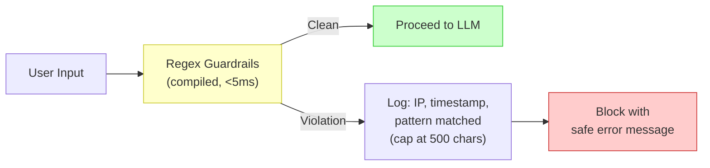
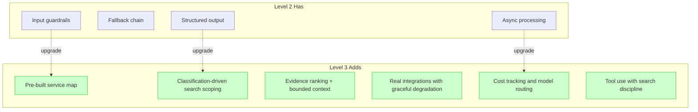

# 003 — Level 2: Structured Agent

**Your first real agent.** The output is guaranteed, the input is guarded, and failures don't crash the system.

---

## What Level 2 Looks Like

## Characteristics

| Capability | Level 2 Status |
|------------|---------------|
| Output format | Framework-enforced (PydanticAI / tool-use schema) |
| Error handling | Deterministic fallback chain — never returns empty |
| Input safety | Regex guardrails (10-15 compiled patterns, <5ms) |
| Tools | None or minimal lookup tools (2-4 deterministic) |
| Processing | Async — 202 Accepted, background task |
| Cost tracking | None yet |

## The Reliability Foundation

### Structured Output Enforcement

Two approaches, both effective:

**Who used what**:
- **PydanticAI approach**: #1 (cszdiego), #3 (AgentNOOB) — Gemini models
- **Tool-use forcing**: #2 (jjovalle99), #5 (Core Tech Expert) — Claude models

### The Fallback Chain

This is what separates Level 2 from Level 1. When structured output fails, the system degrades gracefully:

**Critical rule**: NEVER return an empty result. NEVER crash. Every incident gets a usable triage, even if it's a conservative default routing to the generic SRE team.

### Input Guardrails

Pre-compiled regex patterns that run before any LLM call:

**Patterns observed across finalists** (10-16 regex each):

| Category | Example Patterns |
|----------|-----------------|
| SQL injection | `DROP TABLE`, `UNION SELECT`, `; DELETE` |
| Code execution | `eval(`, `exec(`, `__import__` |
| Prompt injection | `ignore previous`, `system prompt`, `DAN` |
| Data exfiltration | `curl`, `wget`, base64 encoded URLs |
| Format manipulation | `<\|im_start\|>`, `[INST]`, `<system>` |

## Evidence from Finalists

### #3 AgentNOOB (Level 2)
- PydanticAI with `output_type=TriageResult`
- 13 compiled regex guardrail patterns
- Embedded knowledge base (Python dict) for service lookup
- Background processing via FastAPI BackgroundTasks

### #4 ARIA (Level 2)
- Gemini 2.0 Flash with structured output
- 16 regex guardrails including jailbreak detection
- 3-tier JSON extraction fallback
- Real integrations (Linear + Jira + Discord + SMTP)

## Level 2 Checklist

Before claiming Level 2:

- [ ] Output schema enforced by framework (not prompt instructions)
- [ ] Fallback chain: retry → regex extract → rule-based → safe default
- [ ] 10+ regex guardrail patterns compiled and tested
- [ ] Async processing (202 Accepted + background task)
- [ ] Guardrails run BEFORE any LLM call
- [ ] Violations logged with context (but content capped at 500 chars)
- [ ] No path where the system returns empty or crashes

## What Level 2 Is Missing

---

*Previous: [002 — Level 1: Prompt & Parse](002-level-1-prompt-and-parse.md) | Next: [004 — Level 3: Context-Engineered Agent](004-level-3-context-engineered.md)*
