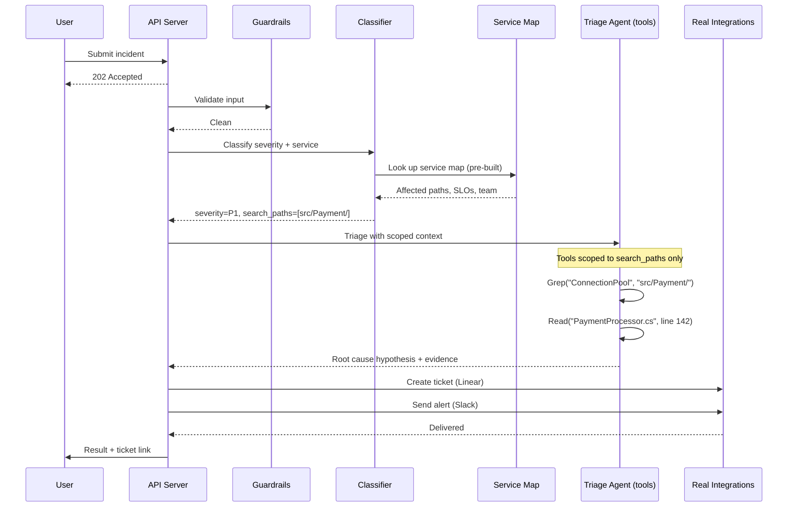
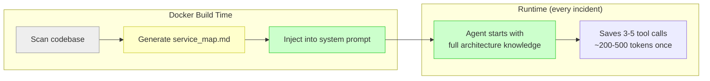
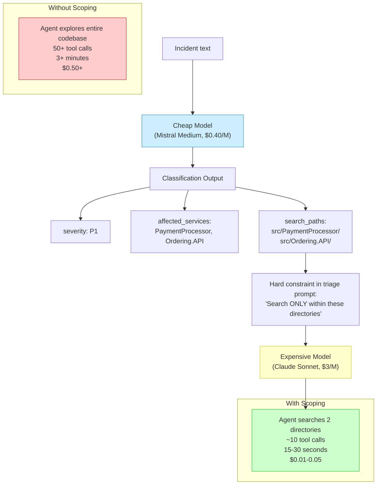
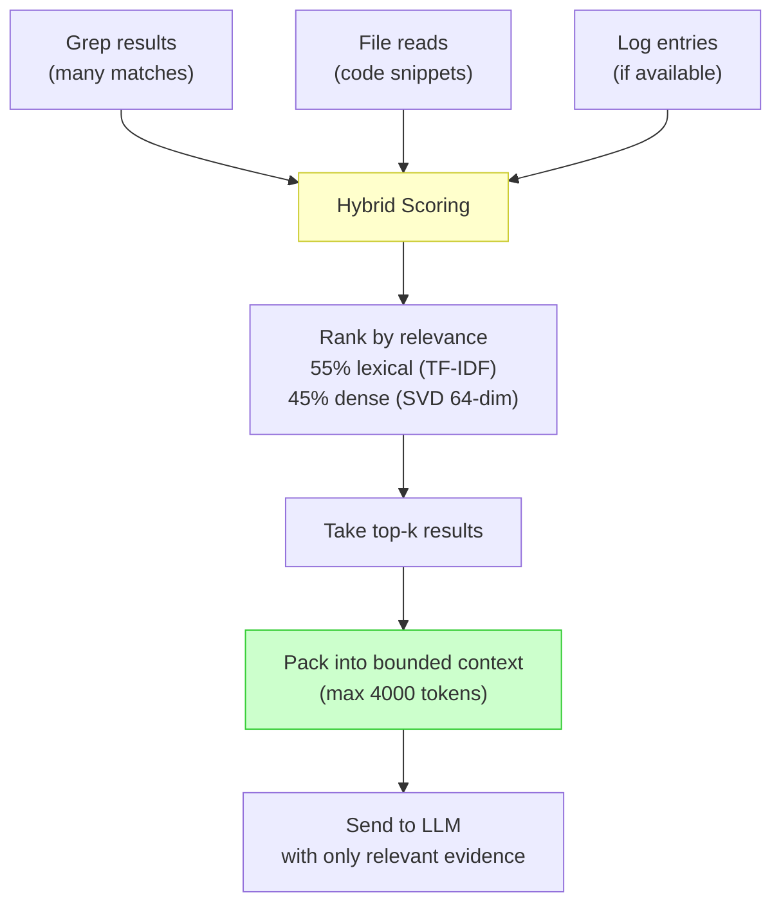
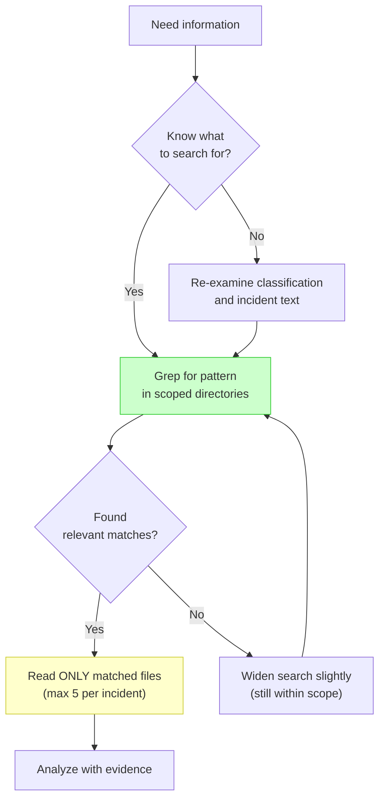
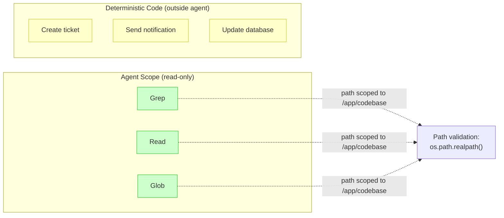
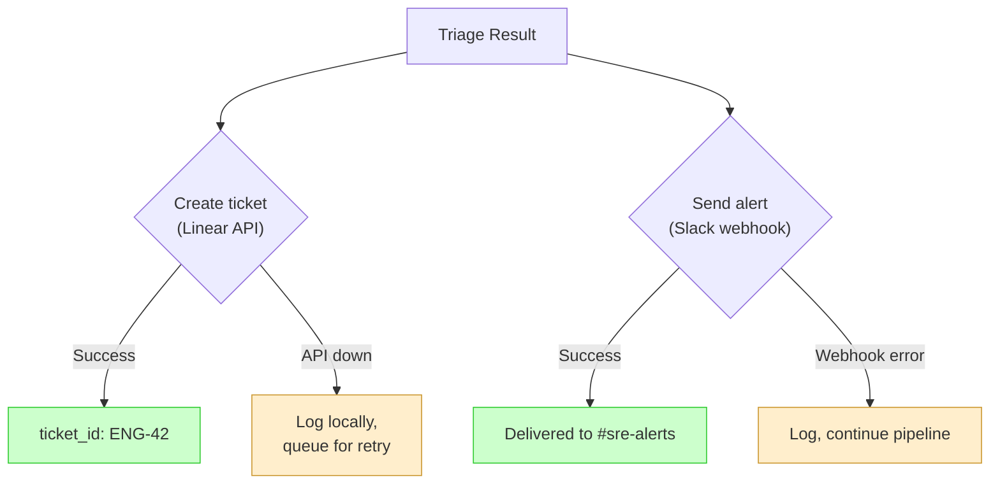

# 004 — Level 3: Context-Engineered Agent

**The quality leap.** This is where agents stop guessing and start knowing. Context engineering — controlling exactly what information reaches the LLM and when — was the single biggest differentiator between good and great implementations.

---

## What Level 3 Looks Like

## The Three Pillars of Context Engineering

### Pillar 1: Static Context Injection (Build-Time)

Pre-compute codebase knowledge once. Inject as system prompt. Save 3-5 tool calls per incident.

**Implementations**:
| Team | Method | Token Cost |
|------|--------|------------|
| #2 | `scripts/generate-eshop-map.sh` at Docker build | ~200 tokens |
| #3 | Python dict with SLOs + failure patterns + team mappings | ~300 tokens |
| #1 | Hardcoded service-keyword mapping + exception heuristics | ~150 tokens |

### Pillar 2: Classification-Driven Context Scoping

Cheap model classifies first. Output constrains expensive model's search space.

**5x reduction** in both latency and cost. This is the highest-ROI technique observed.

### Pillar 3: Evidence Ranking & Bounded Context

Don't dump everything into the prompt. Rank evidence, pack the best into a bounded window.

**Key insight from #5**: Used scikit-learn SVD (64-dim) + pgvector. No external embedding API. Zero dependency, fast, reproducible. For small corpora (<1000 docs), this outperforms complex embedding pipelines.

## Tool Use Discipline

Level 3 agents have tools — but with strict discipline.

### The Search Discipline: Grep-First, Read-Second

**Rules enforced by #2 finalist**:
1. ALWAYS Grep for patterns FIRST (never Read blind)
2. Read ONLY relevant files (maximum 5 per incident)
3. NEVER Glob an entire directory
4. Combined with search_paths constraint, max ~10 tool calls

### Tool Safety: Read-Only, Always

**Critical pattern**: Agent tools have ZERO side effects. All mutations happen in deterministic pipeline stages outside the agent loop.

## Real Integrations with Graceful Degradation

Level 3 wires real integrations but handles failure gracefully:

**Pattern**: `if API_KEY present → real provider; else → mock silently`. Never crash because an integration is misconfigured.

## Evidence from Finalists

### #1 cszdiego (Level 3, Winner)
- Pre-built service-keyword mapping + exception heuristics
- PydanticAI with Gemini 2.5 Flash
- Real Jira + Slack + Gmail integrations
- SSE streaming for real-time progress
- Cost: ~$0.01-0.03/incident

### #2 jjovalle99 (Level 3-4, Most Innovative)
- `generate-eshop-map.sh` at Docker build time
- Classification-driven search path scoping (the key innovation)
- Grep-first/Read-second discipline
- 140 tests, 95% coverage
- Cost: $0.007/incident

## Level 3 Checklist

- [ ] Pre-built service map injected as system prompt (build-time)
- [ ] Classification drives search scope before expensive triage
- [ ] Agent tools scoped to specific directories (path validation)
- [ ] Grep-first, Read-second discipline enforced in prompt
- [ ] Tool call budget set (10-15 max)
- [ ] At least one real integration per category (ticket, message, email)
- [ ] Graceful degradation when integrations fail
- [ ] Evidence ranked before packing into LLM context
- [ ] Cost per incident tracked (even if just logged)

---

*Previous: [003 — Level 2: Structured Agent](003-level-2-structured-agent.md) | Next: [005 — Level 4: Production Pipeline](005-level-4-production-pipeline.md)*
