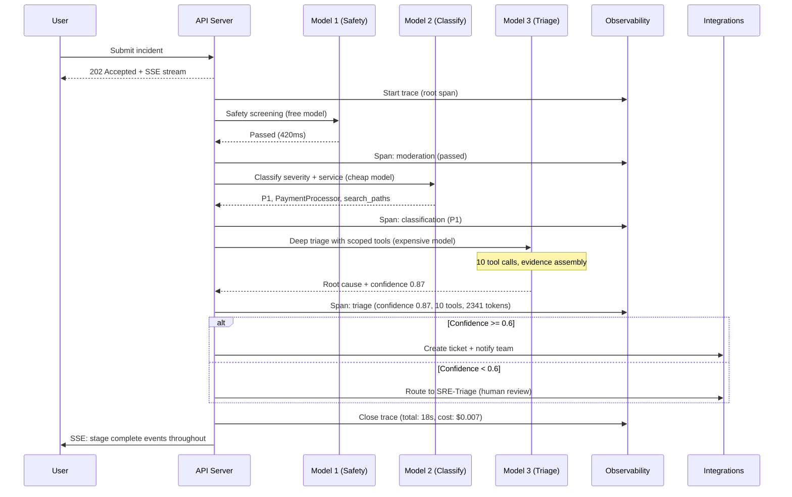
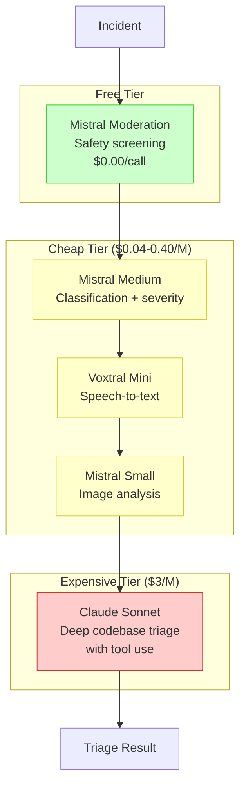
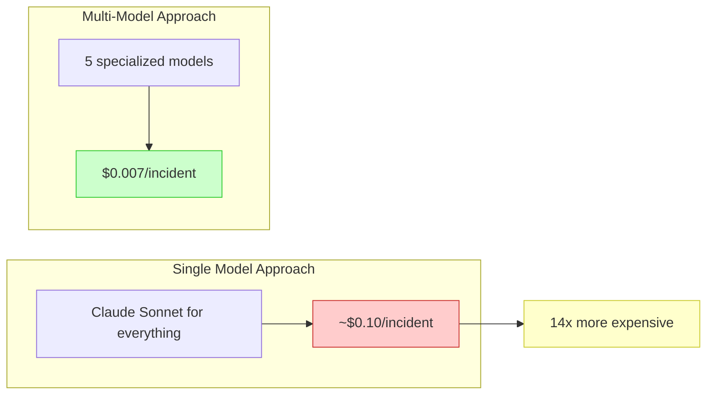
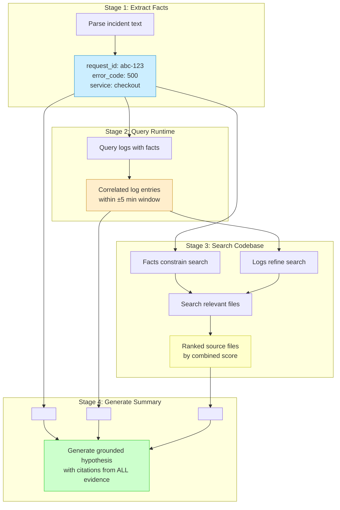
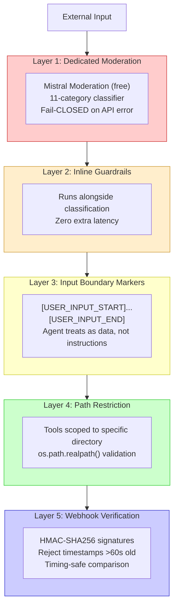
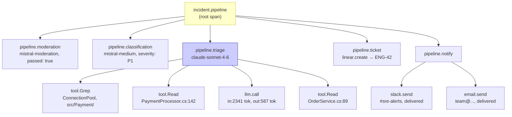
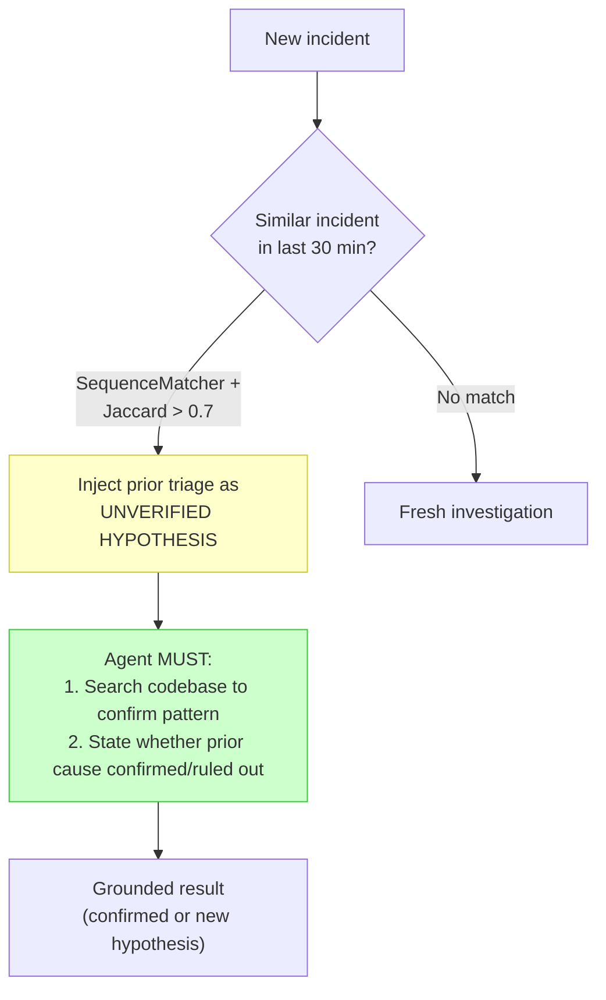

# 005 — Level 4: Production Pipeline

**Production-grade.** Multiple models, staged context assembly, defense-in-depth security, full observability, and temporal memory. This is where agent systems become enterprise-ready.

---

## What Level 4 Looks Like

## Multi-Model Routing

The defining feature of Level 4: different models for different tasks.

### Cost Impact (Real Data)

| Task | Model | Cost/M tokens | % of Total Cost |
|------|-------|--------------|-----------------|
| Safety screening | Mistral Moderation | $0.00 | 0% |
| Classification | Mistral Medium | $0.40 | ~1% |
| Speech-to-text | Voxtral Mini | $0.04 | <1% |
| Image analysis | Mistral Small | $0.60 | ~1% |
| Deep triage | Claude Sonnet | $3.00 | **~98%** |

**Lesson**: The triage step dominates cost. Optimize everything else to be cheap or free. The 14x savings come from NOT using Sonnet for classification, safety, and extraction.

## Staged Context Assembly

Build context progressively — each stage's output improves the next stage's query.

**Why staged assembly beats dump-everything**: If you throw incident text + all logs + all code at the LLM, you get noise. Each stage filters and refines, so the final LLM call sees only relevant, pre-ranked evidence.

## Defense-in-Depth Security (5 Layers)

**Fail-closed principle**: If the safety check itself fails (API timeout, error), block the input. Safety over availability for external-facing inputs.

## Comprehensive Observability

### Trace Hierarchy

### Three Pillars + Agent Extension

| Pillar | Standard | Agent-Specific Extension |
|--------|----------|--------------------------|
| **Logging** | JSON structured | Per-stage context binding (incident_id, severity, confidence) |
| **Metrics** | Request count, latency | Token usage, LLM call count, cost/incident, guardrail blocks |
| **Tracing** | HTTP request spans | Tool-call spans, LLM generation spans, evidence retrieval spans |
| **Reasoning** | — | Live reasoning steps via SSE for user visibility |

### Tooling

| Tool | Best For | Used By |
|------|----------|---------|
| **Arize Phoenix** | OpenTelemetry native, free, LLM-specific views | #2, #5 |
| **Langfuse** | LLM observability, prompt analytics, sessions | #1, #7, #10, #11 |
| **Prometheus** | Metrics, alerting, cost tracking | #3, #5 |
| **Jaeger** | Distributed traces, lightweight | #3, #9 |

## Temporal Memory (Deduplication)

**Critical guardrail**: Always label prior context as "unverified." Without this, agents blindly copy prior results (force-fit trap).

## Evidence from Finalists

### #2 jjovalle99 (Level 4, Most Cost-Efficient)
- 5 models in staged pipeline ($0.007/incident)
- Defense-in-depth: Mistral Moderation + inline guardrails + boundary markers + path restriction + HMAC webhooks
- Arize Phoenix traces with full tool-call spans
- SequenceMatcher + Jaccard deduplication (30-min window)
- 140 tests, 95% coverage

### #5 Core Tech Expert (Level 4, Most Enterprise)
- 10-stage LangGraph pipeline with DB transaction per stage
- Hybrid retrieval: TF-IDF + SVD (64-dim) on pgvector
- Arize Phoenix + Loki + Grafana + Prometheus
- Staged context assembly (facts → logs → code → summary)
- ClamAV malware scan + Tesseract OCR on uploads

## Level 4 Checklist

- [ ] Multiple models routed by task (cheap classify, expensive reason)
- [ ] Staged context assembly (progressive evidence building)
- [ ] Checkpoint & recovery for pipelines >30s
- [ ] Defense-in-depth security (3+ layers, fail-closed)
- [ ] Full observability: traces + metrics + structured logs
- [ ] Key trace attributes: incident_id, severity, confidence, tokens, cost
- [ ] Deduplication against recent incidents (temporal window)
- [ ] Prior context labeled as "unverified hypothesis"
- [ ] Confidence-based routing (low confidence → human escalation)
- [ ] Evidence-based documentation (real numbers from real runs)
- [ ] SSE/WebSocket streaming for real-time progress

---

*Previous: [004 — Level 3: Context-Engineered Agent](004-level-3-context-engineered.md) | Next: [006 — Level 5: Autonomous Investigation](006-level-5-autonomous-investigation.md)*
