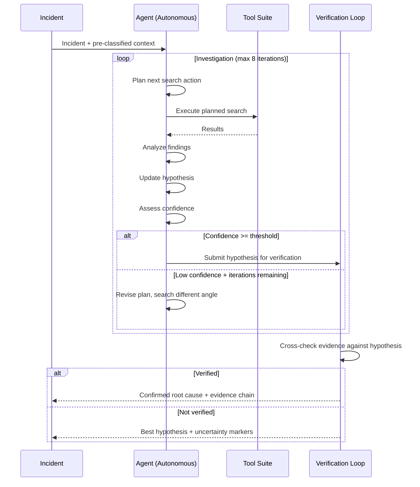
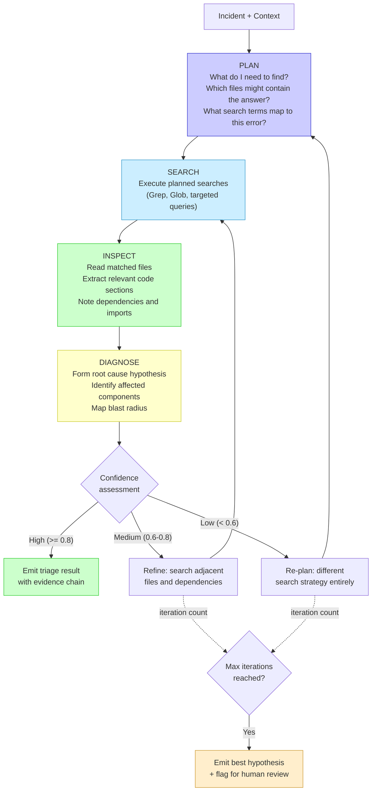
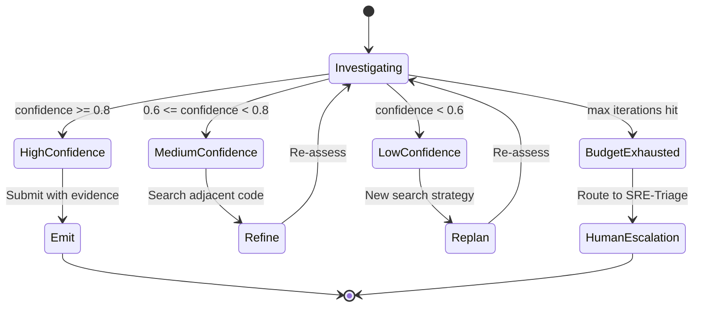
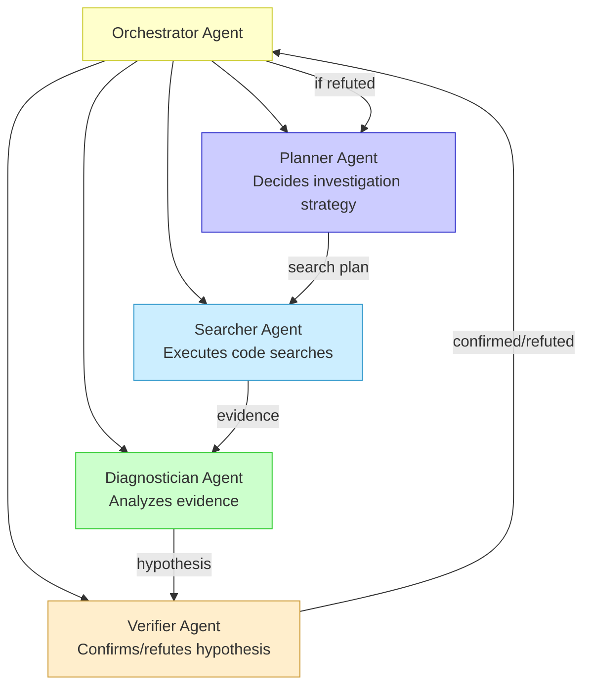
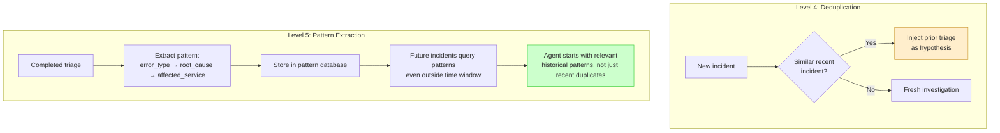

# 006 — Level 5: Autonomous Investigation

**The frontier.** The agent drives its own investigation strategy — planning what to search, adapting based on findings, and self-correcting when confidence is low. No finalist fully achieved this level. #9 (Team Omar) came closest.

---

## What Level 5 Looks Like

## The Active Retrieval Pattern

Inspired by OpenAI Codex's approach to code understanding. The agent doesn't follow a fixed search sequence — it plans, executes, and adapts.

## Self-Correction Mechanism

Level 5 agents don't just report confidence — they act on it.

**Contrast with Level 3-4**: At those levels, the agent searches within a fixed scope and reports whatever it finds. At Level 5, the agent evaluates its own findings and changes strategy if they're insufficient.

## Investigation Budget Management

```mermaid
gantt
    title Tool Call Budget Over Time (Level 5 Agent)
    dateFormat X
    axisFormat %s

    section Iteration 1
    Plan search strategy       :a1, 0, 1
    Grep for error patterns    :a2, 1, 2
    Read 2 matched files       :a3, 2, 4
    Assess: confidence 0.4     :a4, 4, 5

    section Iteration 2 (replanned)
    Grep for dependency chain  :b1, 5, 6
    Read upstream service      :b2, 6, 7
    Read config file           :b3, 7, 8
    Assess: confidence 0.7     :b4, 8, 9

    section Iteration 3 (refined)
    Grep for recent changes    :c1, 9, 10
    Read changelog             :c2, 10, 11
    Assess: confidence 0.85    :c3, 11, 12
    Emit result                :c4, 12, 13
```

| Budget Type | Mechanism | Observed Limit |
|-------------|-----------|----------------|
| Iteration count | Counter in tool-use loop | max 8 (#11) |
| Tool call count | Hard limit per investigation | max 20 (#10) |
| File read limit | Max lines per file read | 500 lines (#10) |
| Time budget | Wall-clock timeout | 180s typical |

## Multi-Agent Collaboration (Emerging)

No finalist fully implemented this, but the architecture is visible in #9's approach:

**Handoff protocol**: Each agent's output becomes the next agent's input with explicit schema. The orchestrator manages iteration budget and decides when to stop.

## Learning from Past Incidents (Beyond Dedup)

Level 4 has deduplication (same incident = same triage). Level 5 extracts patterns:

## Evidence from Finalists

### #9 Team Omar (Closest to Level 5)
- "Codex-inspired active retrieval": plan → search → inspect → diagnose → verify
- LangGraph with 13 nodes and checkpoint-based recovery
- If confidence low, regenerates hypothesis once (single retry)
- Full investigation history preserved in LangGraph checkpoints
- **Gap**: Single retry, not iterative refinement. No pattern extraction.

### #11 AgenticTulkuns (Partial Level 5)
- Tool-use loop with max 8 iterations
- Agent decides when to stop based on accumulated evidence
- **Gap**: No explicit confidence assessment or self-correction strategy

## Level 5 Checklist

- [ ] Agent plans its own investigation strategy (not following fixed search)
- [ ] Active retrieval: plan → search → inspect → diagnose → verify
- [ ] Confidence-driven self-correction (low = replan, medium = refine)
- [ ] Iteration budget with hard limits (max 8-20 tool calls)
- [ ] Investigation history preserved for audit
- [ ] Multi-agent handoff protocol (emerging, not required)
- [ ] Pattern extraction from completed triages (emerging)
- [ ] Time/cost budget management (wall-clock + token tracking)

## The Gap to Level 5

What makes Level 5 hard:

| Challenge | Why It's Hard |
|-----------|--------------|
| Unpredictable latency | Investigation length varies by incident complexity |
| Cost bounding | More iterations = more tokens = more cost |
| Quality assessment | Agent must judge its own work (meta-cognition) |
| Strategy diversity | Agent needs multiple search strategies to switch between |
| Termination criteria | When is "enough evidence" enough? |

---

*Previous: [005 — Level 4: Production Pipeline](005-level-4-production-pipeline.md) | Next: [007 — Beyond Level 5](007-beyond-level-5.md)*
