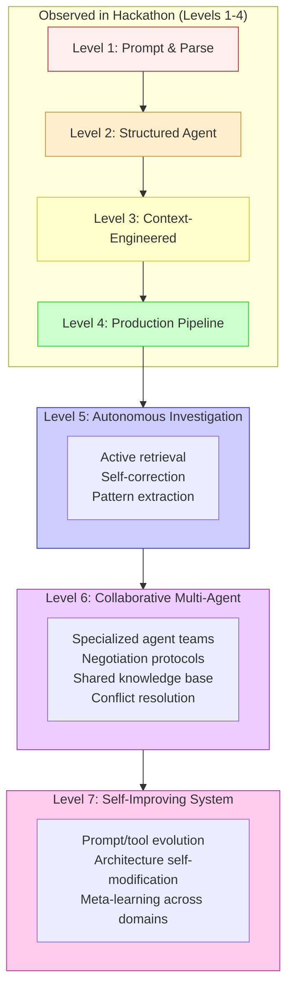
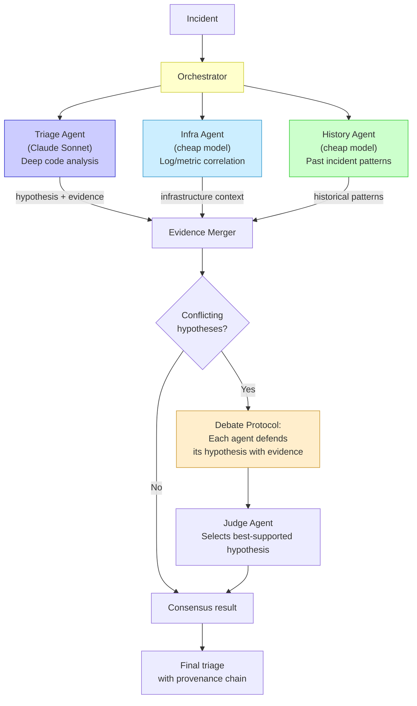
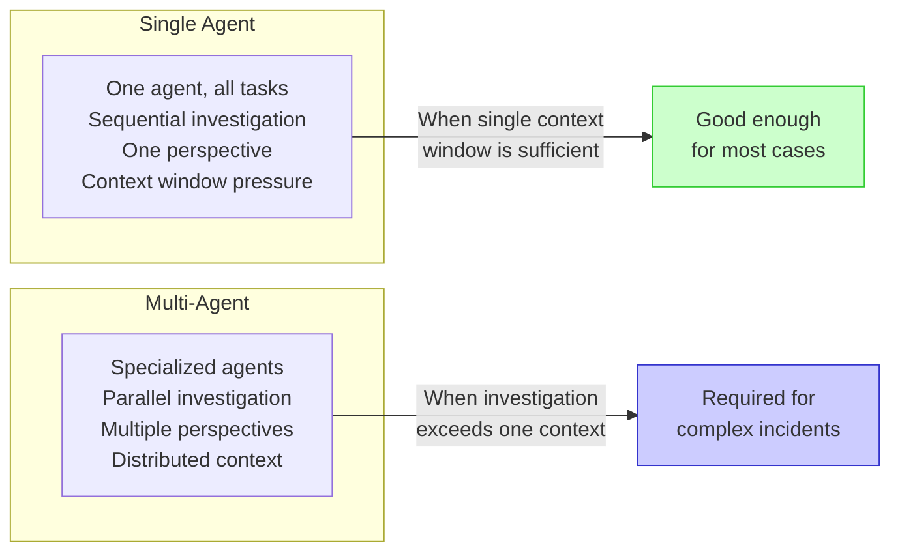
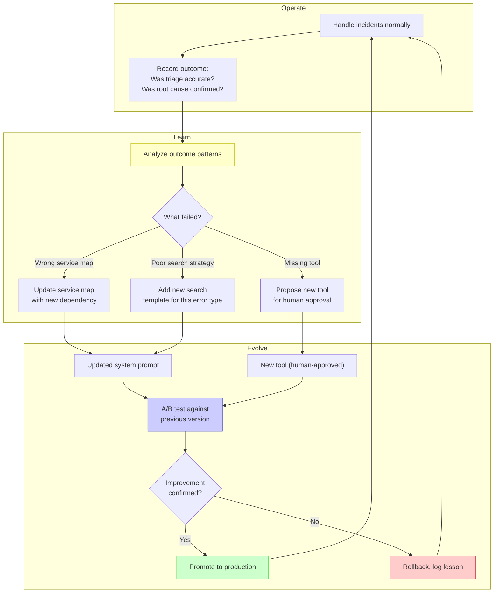
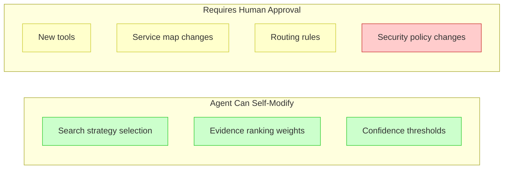
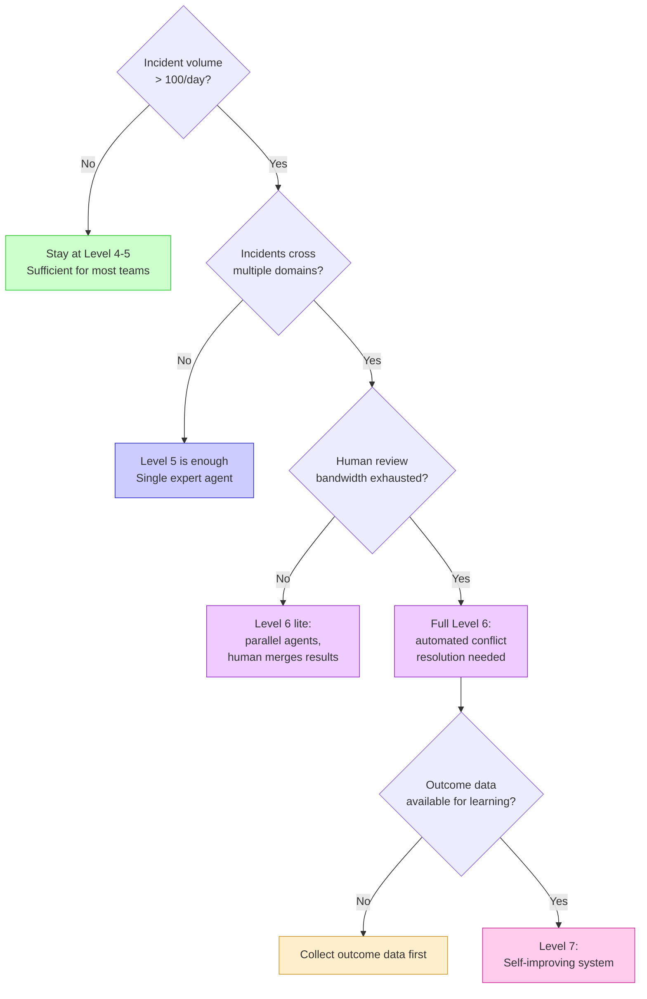

# 007 — Beyond Level 5: Emerging Patterns

**The theoretical frontier.** No implementation in the analysis fully achieved Level 5, and these levels are extrapolations based on observable trends in agent research, multi-agent systems, and self-improving architectures. They are included because someone building agents should know where the field is heading — even if they shouldn't build for it today.

---

## The Extended Maturity Model

## Level 6: Collaborative Multi-Agent System

Multiple specialized agents working together with explicit handoff protocols, shared state, and conflict resolution.

### Key Capabilities

| Capability | What It Means |
|------------|--------------|
| **Specialized roles** | Each agent has domain expertise (code, infra, history) |
| **Parallel investigation** | Agents search simultaneously, reducing wall-clock time |
| **Shared knowledge base** | Findings from one agent available to all others |
| **Conflict resolution** | When hypotheses disagree, structured debate resolves it |
| **Provenance tracking** | Final result traces back to which agent contributed what |

### Why Not Just One Better Agent?

**Practical threshold**: Multi-agent becomes valuable when an investigation requires more context than a single agent can hold, or when different domain expertise is needed (code vs. infrastructure vs. business logic).

## Level 7: Self-Improving System

The agent system evolves its own capabilities based on outcomes.

### Key Capabilities

| Capability | What It Means | Risk |
|------------|--------------|------|
| **Prompt evolution** | System prompt improves based on outcome data | Prompt drift, regression |
| **Tool creation** | Agent proposes new tools for recurring patterns | Requires human gate |
| **Service map updates** | Architecture knowledge auto-updates when code changes | Stale data, hallucination |
| **Strategy library** | Successful investigation strategies stored and reused | Overfitting to past patterns |
| **A/B testing** | New capabilities tested against baseline before promotion | Requires outcome metrics |

### The Human-in-the-Loop Boundary

## When to Aim Beyond Level 5

## Caveats

1. **Levels 6-7 are extrapolations**, not observed implementations. They represent where the field is heading based on research patterns and multi-agent frameworks (LangGraph, CrewAI, AutoGen).

2. **Premature sophistication is an anti-pattern.** Most teams should aim for Level 3-4 and stay there until they have clear evidence that Level 5+ is needed. See [008-anti-patterns.md](008-anti-patterns.md).

3. **Self-improvement requires outcome data.** If you can't measure whether a triage was accurate (human closes the loop), you can't learn from it. Collect outcome data at Level 4 before attempting Level 7.

---

*Previous: [006 — Level 5: Autonomous Investigation](006-level-5-autonomous-investigation.md) | Next: [008 — Anti-Patterns](008-anti-patterns.md)*
