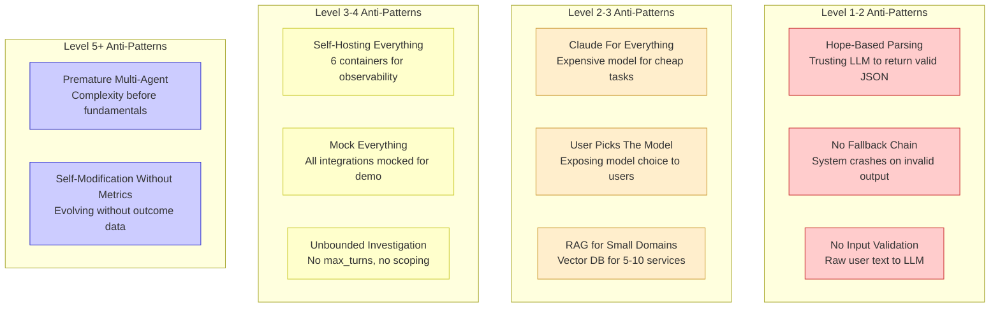
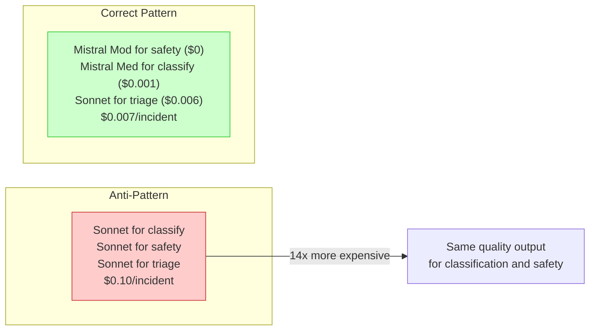
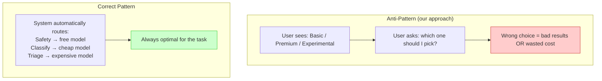
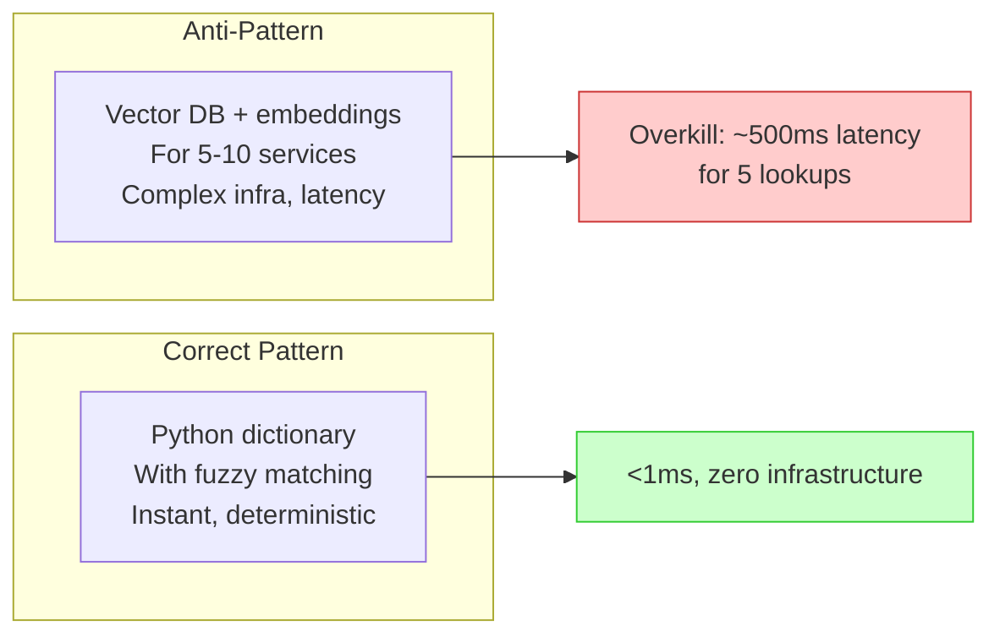
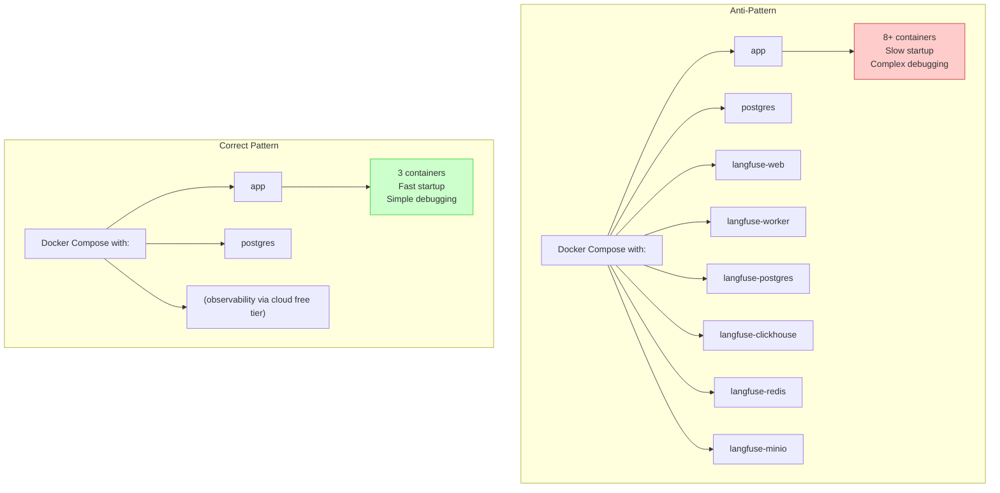
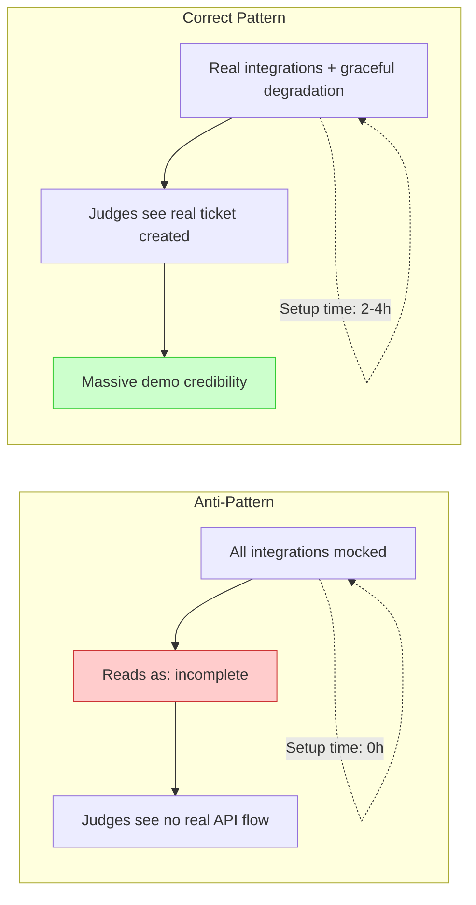
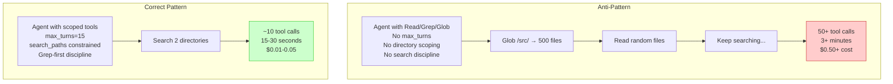
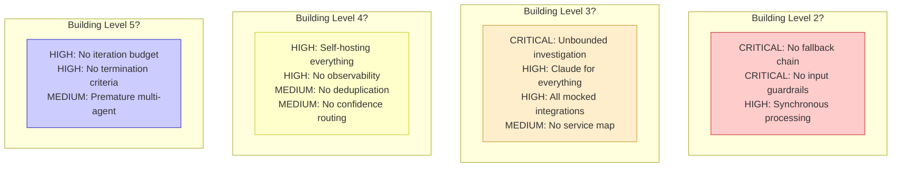
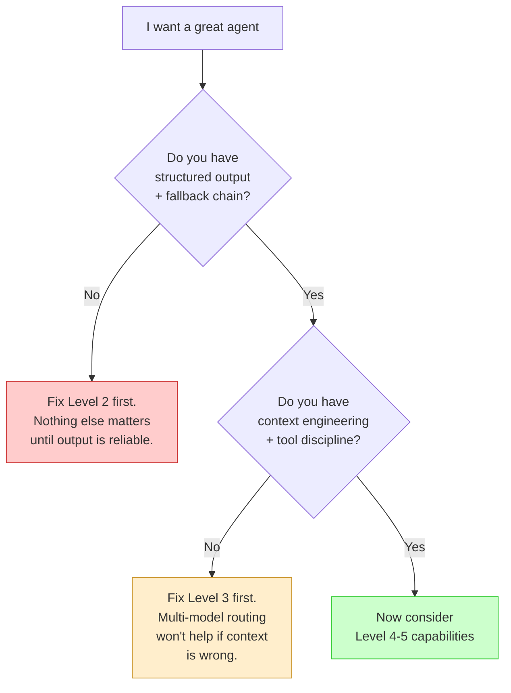

# 008 — Anti-Patterns: What NOT to Do

**Lessons from failure.** These anti-patterns were observed across the 12 implementations — some in the finalists, some in our own submission. Each is mapped to the maturity level where it becomes most dangerous.

---

## Anti-Pattern Map

## Detailed Anti-Patterns

### AP1: "Use Claude for Everything"

**Impact**: 14x cost difference for no quality gain on simple tasks.
**Fix**: Route by task complexity. Only use expensive models for reasoning-heavy tasks.
**Evidence**: #2 achieved $0.007/incident with 5 models. "Claude for everything" costs ~$0.10.

### AP2: "User Picks the Model"

**Impact**: Users don't know which model fits their incident. Results in either bad quality (cheap model for complex incident) or wasted cost (expensive model for simple classification).
**Fix**: Automatic model routing by task. The system decides, not the user.
**Evidence**: Our Triagista offered 3 engine choices. No finalist exposed model selection to users.

### AP3: "RAG for Small Domains"

**Threshold**: RAG makes sense at 100+ documents. Below that, a dictionary with fuzzy matching is faster, simpler, and more reliable.
**Evidence**: #3 used a Python dict for service lookup. #5 used scikit-learn SVD (no external API) for its larger corpus.

### AP4: "Self-Hosting Everything"

**Impact**: 6 extra containers for observability when Langfuse Cloud free tier (500K obs/month) or Phoenix Cloud exists.
**Fix**: Use cloud-hosted free tiers for demos. Only self-host when data sovereignty requires it.
**Evidence**: Our submission ran 6+ containers. Winners ran 2-4 containers.

### AP5: "Mock Everything for Hackathon"

**Impact**: The #1 reason our submission didn't make the cut. Every top-5 finalist had real integrations.
**Fix**: Wire at least one real integration per category. Linear free tier + Slack webhook + Resend free tier = zero cost, 2-4 hours setup.
**Evidence**: Our submission had all-mocked integrations. This was a deliberate founding decision made on commit 1 and never challenged.

### AP6: "Unbounded Agent Investigation"

**Impact**: 5x latency, 10x cost, often worse results (noise drowns signal).
**Fix**: Classify first → scope directories → enforce Grep-first → set max_turns budget.

## Anti-Pattern Severity by Maturity Level

## The Meta Anti-Pattern: Premature Sophistication

The biggest anti-pattern is not any single mistake — it's building Level 4-5 capabilities before Level 2-3 fundamentals are solid.

---

*Previous: [007 — Beyond Level 5](007-beyond-level-5.md) | Next: [009 — Implementation Roadmap](009-implementation-roadmap.md)*
