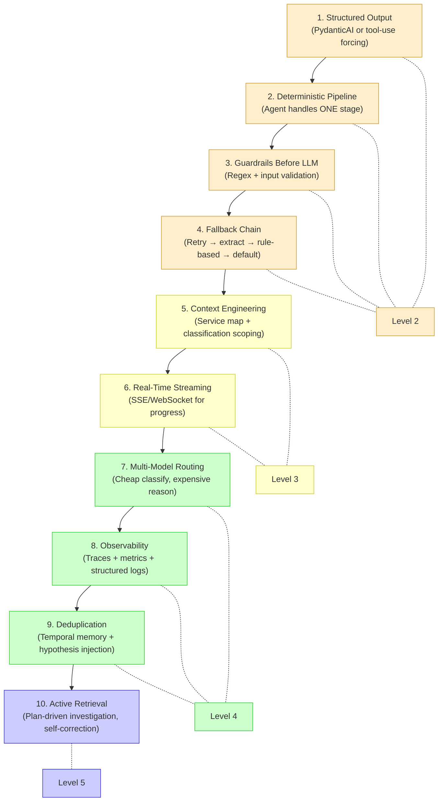
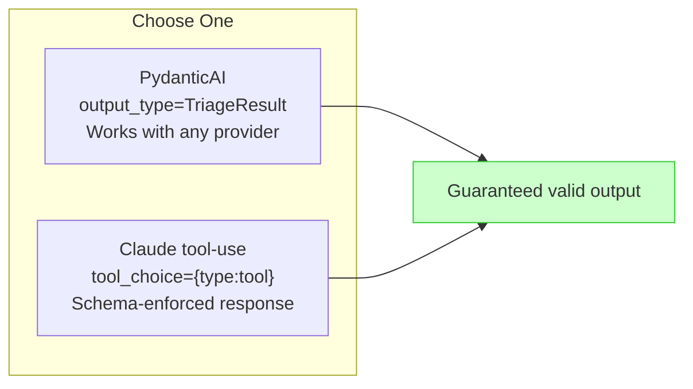
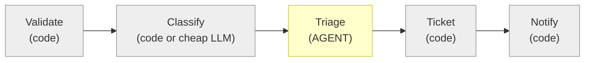
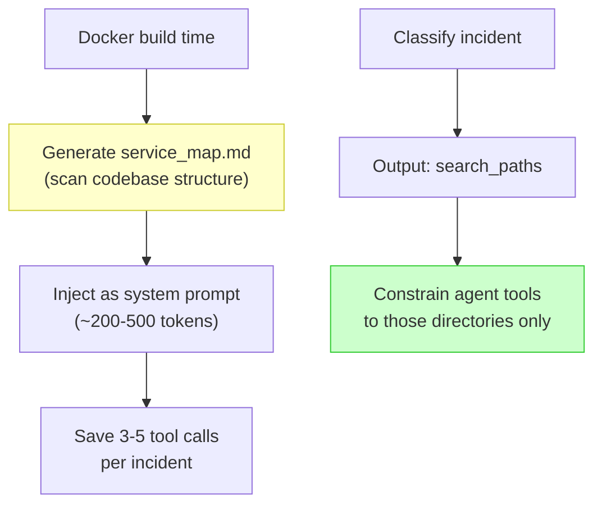
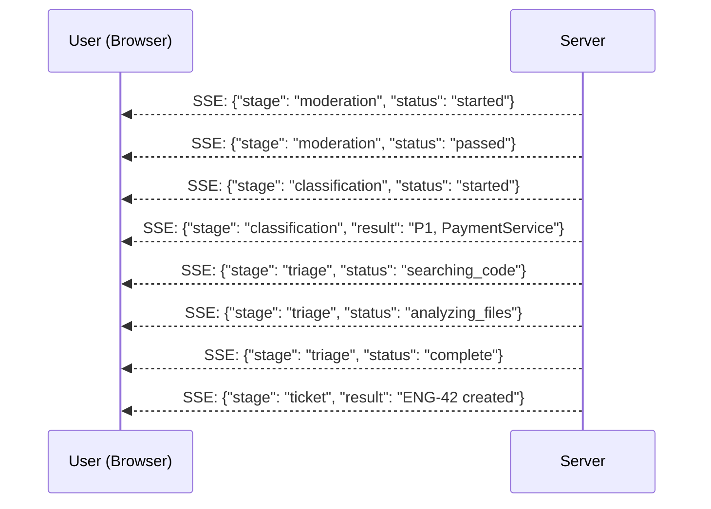
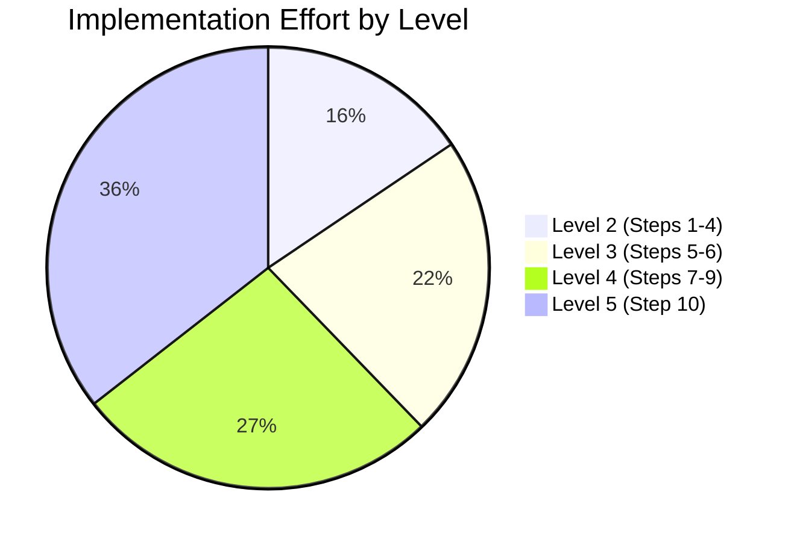
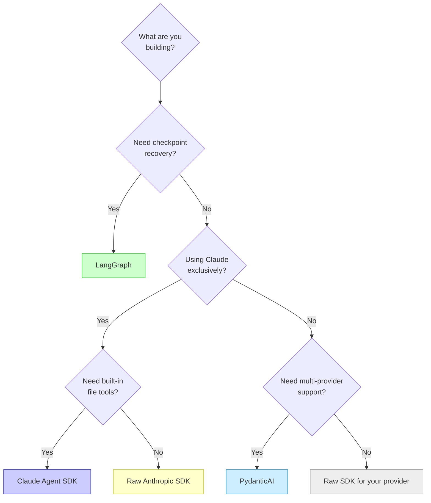
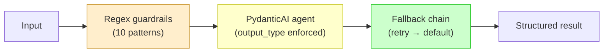

# 009 — Implementation Roadmap

**The practical guide.** If you're building an agent from scratch, implement these capabilities in this exact order. Each step builds on the previous. Skip nothing.

---

## The 10-Step Climb



## Step-by-Step Detail

### Step 1: Structured Output (Foundation)

**What**: Use framework-level schema enforcement, not prompt instructions.
**Why**: Everything else depends on reliable, parseable output.
**Effort**: 2-3 hours



### Step 2: Deterministic Pipeline

**What**: Agent handles ONE stage (triage). Everything else is code.
**Why**: Predictable behavior, easy debugging, clear boundaries.
**Effort**: 2-4 hours



### Step 3: Guardrails Before LLM

**What**: Compiled regex patterns. Run before any token is consumed.
**Why**: Blocks injection attacks. <5ms cost. No reason to skip.
**Effort**: 1-2 hours

### Step 4: Fallback Chain

**What**: LLM fails → retry → regex extract → rule-based → safe default.
**Why**: 15% of LLM responses will fail validation. The chain catches them all.
**Effort**: 2-3 hours

### Step 5: Context Engineering

**What**: Pre-built service map + classification-driven scoping.
**Why**: This is where quality jumps. The LLM sees only relevant context.
**Effort**: 4-6 hours



### Step 6: Real-Time Streaming

**What**: SSE/WebSocket events for pipeline progress.
**Why**: Makes the agent feel responsive. Dead air during processing kills demos.
**Effort**: 4-6 hours



### Step 7: Multi-Model Routing

**What**: Cheap models for classification/safety, expensive for reasoning.
**Why**: This is where cost drops 10-14x.
**Effort**: 4-6 hours

### Step 8: Observability

**What**: Langfuse/Phoenix for LLM traces, Prometheus for metrics.
**Why**: Without traces, you can't debug why the agent made a decision.
**Effort**: 4-8 hours (instrument from day one — harder to add retroactively)

### Step 9: Deduplication

**What**: Compare against recent incidents, inject prior context as hypothesis.
**Why**: Reduces redundant investigation. Speeds up repeated incidents.
**Effort**: 2-4 hours

### Step 10: Active Retrieval

**What**: Agent plans investigation, adapts based on findings, self-corrects.
**Why**: Only needed when domain requires deep investigation.
**Effort**: 8-16 hours

## Effort Breakdown



| Level | Steps | Estimated Hours | Cumulative |
|-------|-------|----------------|------------|
| Level 2 | 1-4 | 7-12h | 7-12h |
| Level 3 | 5-6 | 8-12h | 15-24h |
| Level 4 | 7-9 | 10-18h | 25-42h |
| Level 5 | 10 | 8-16h | 33-58h |

**Hackathon note**: In a 48-hour hackathon, a solo builder can realistically achieve Level 3 with parts of Level 4. Aim for Steps 1-6 + one real integration. That's the winning formula.

## Framework Comparison

Choose your framework based on what you're building:



| Framework | Best For | Structured Output | Tool Use | Checkpoint | Used By |
|-----------|---------|-------------------|----------|------------|---------|
| **PydanticAI** | Simple agents, any provider | Native (output_type) | @tool decorator | No | #1, #3 |
| **Claude Agent SDK** | Claude + file tools | Via output_format | Built-in Read/Grep/Glob | No | #2, Us |
| **LangGraph** | Complex multi-stage | Via tool-use | Custom nodes | Yes (DB) | #5, #9 |
| **Raw Anthropic SDK** | Fine-grained control | tool_choice + schema | Custom tools | Manual | #2, #5, #10 |
| **Raw Google GenAI** | Gemini + cheap inference | response_mime_type | Custom tools | No | #1, #4 |

**Notable absence**: No finalist used LangChain. PydanticAI and raw SDKs dominated. The trend is toward simpler, more explicit frameworks over heavy abstractions.

## The Minimum Viable Agent

If you have **4 hours**, build this:



This gets you to **Level 2** — a working agent with guaranteed output, basic safety, and graceful failure handling. Everything beyond this is optimization.

## The Winning Formula (48-Hour Hackathon)

```mermaid
gantt
    title Hackathon Implementation Order
    dateFormat HH
    axisFormat %H:00

    section Level 2 Foundation
    Structured output + fallback     :a1, 00, 04
    Guardrails + async processing    :a2, 04, 06

    section Level 3 Quality
    Service map + context scoping    :a3, 06, 10
    Tool discipline (Grep-first)     :a4, 10, 12

    section Real Integrations
    Linear + Slack + Resend (free)   :a5, 12, 16

    section SSE Streaming
    Pipeline progress events         :a6, 16, 20

    section Polish
    Seed data + demo prep            :a7, 20, 24
    Documentation with real numbers  :a8, 24, 26

    section Buffer
    Fix issues + edge cases          :a9, 26, 30
```

**Total: 30 hours of focused building.** Leaves 18 hours for sleep, meals, and debugging. This is the path the top finalists followed.

---

*Previous: [008 — Anti-Patterns](008-anti-patterns.md) | Start over: [000 — Overview](000-overview.md)*
