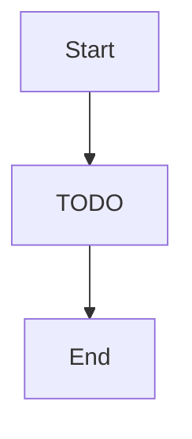

# Guardrails — "Bouncer checking IDs at the door before anyone talks to the oracle"

> Input validation + injection patterns before any LLM call

**Paths:** `app/agent/guardrails.py, app/agent/triage.py`

---

## Purpose

<!-- 2-3 sentences: what this section of the application does and why it exists. -->
<!-- Populated manually by the human, or auto-appended from verified /gabe-teach topics. -->

## Key Decisions

<!-- Load-bearing choices for this well. Each entry: date + one-line title + 1-2 paragraph rationale. -->
<!-- Example:
### 2026-04-15 — Guardrails run before the LLM, not after
Reasoning: ...
-->

## Key Diagrams

<!-- Suggested diagram type for this well: flowchart (picked by gabe-docs per-well heuristic) -->
<!-- Replace placeholder with a real diagram once the flow stabilizes. Keep ≤15 nodes. -->

## Architecture patterns

### input-guardrails (foundational · agent, security)

**Verified:** 2026-04-21 via /gabe-teach arch (score 1/2)
**Used in this well's topics:** T1
**Why we use it:** Filter adversarial input before the model sees it — 1000× cheaper than a model call, and names every blocked pattern so ops can trend attack surfaces over time.

## Topics (auto-appended)

<!-- /gabe-teach topics appends verified topic summaries here on first run. -->
<!-- Do not edit the structure below this line; edit individual entries freely. -->

### T1 — Why 15→25 patterns + return matched pattern names

**Class:** WHY  **Verified:** 2026-04-17  **Score:** 1/2  **Source:** working-tree (pre-commit)

**Files:**
- `app/agent/guardrails.py` (+75 -23)
- `tests/test_guardrails.py` (+76 -5)

Expanded the injection-pattern set from 15 anonymous regexes to 25 named ones (role separators, token markers, emphasis bypass, SQL probes, code-exec), and changed the return shape from `{safe: bool, reason: str}` to `SafetyResult{safe, matched: list[str], sanitized, warning}`. The 10 new patterns were easy; naming the original 15 was the load-bearing move. A boolean + free-text reason tells ops *that* something happened — a named-pattern list tells them *which*, which is the only shape a weekly dashboard can `GROUP BY` on. Free-text `reason` strings drift at the phrasing level across edits, making historical aggregation unreliable at the data-shape level.

**Key points:**
- Observability has teeth only with names: telemetry at emit time beats forensics later.
- `list[tuple[str, regex]]` preserves **all** hits (`matched.append(name)` runs per pattern), preserves order, and allows duplicate names for semantic-same attack variants — a dict would force name-uniqueness; a mega-regex would keep only one match.
- `_sanitize()` runs BEFORE matching: strips `\x00`-class control chars and collapses `\n{3,}`, so attackers can't evade `role_separator_human` by padding between `\n\n` and `Human:`.
- Gap noted: when to pick dict over list-of-tuples (answer: when per-pattern policy lookup needs O(1) — but the current code only iterates, so the tradeoff is latent).
