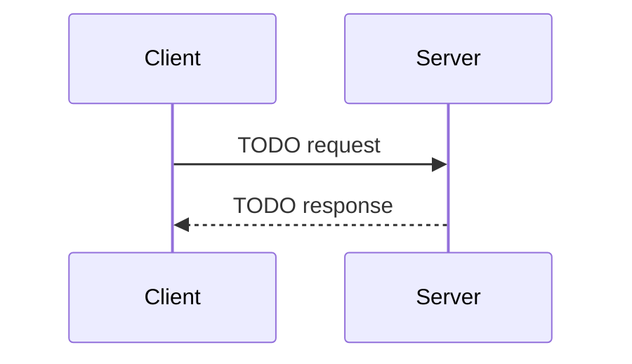

# API Layer — "Reception desk: takes the package, hands a receipt, processes behind the counter"

> HTTP surface, multipart handling, background tasks

**Paths:** `app/api/**`

---

## Purpose

<!-- 2-3 sentences: what this section of the application does and why it exists. -->
<!-- Populated manually by the human, or auto-appended from verified /gabe-teach topics. -->

## Key Decisions

<!-- Load-bearing choices for this well. Each entry: date + one-line title + 1-2 paragraph rationale. -->

## Key Diagrams

<!-- Suggested diagram type for this well: sequenceDiagram (picked by gabe-docs per-well heuristic) -->
<!-- Replace placeholder with a real diagram once the flow stabilizes. Keep ≤15 nodes. -->

## Architecture patterns

### async-background-processing (foundational · agent, web)

**Verified:** 2026-04-20 via /gabe-teach arch (score 1/2)
**Used in this well's topics:** T2
**Why we use it:** Decouple client wait from server work — return 202, stream progress via SSE.

## Topics (auto-appended)

<!-- /gabe-teach topics appends verified topic summaries here on first run. -->
<!-- Do not edit the structure below this line; edit individual entries freely. -->

### T2 — Why multipart + 202 Accepted + BackgroundTask

**Class:** WHY  **Verified:** 2026-04-18  **Score:** 2/2  **Source:** working-tree (pre-commit)

**Files:**
- `app/api/main.py` (+82 -20)
- `tests/test_api.py` (new)

Switched from JSON `IncidentRequest` + inline pipeline + 200 to multipart `Form`+`UploadFile` + guardrails-first + DB insert + 202 Accepted with `BackgroundTasks.add_task(run_triage_pipeline)`. Acceptance and processing run on opposite latency clocks: acceptance must be fast and enforce policy at the door (guardrails, MIME whitelist, 10MB cap); processing is slow and bounded by external systems (LLM, DB, Slack). Pinning them to one synchronous request couples two concerns with clashing budgets. 202+BackgroundTask puts the fast gate in front and the slow work behind — the shape every agentic pipeline converges on because you can't put a 30s LLM call on a user's spinner.

**Key points:**
- Guardrails-at-top of an inline handler doesn't solve the happy-path 30s hold — only the split does.
- Check-order matters: `check_input_safety` runs BEFORE `_save_upload`. Reversing that pays a 10MB disk write per rejected request (DoS amplification) and opens a window where attacker-controlled bytes exist on disk under application-chosen filenames.
- MIME whitelist + 10MB cap are door filters, not quota-based cleanups — fail closed before the write.
- UUID filenames (`uuid.uuid4().hex + ext`): path-traversal-proof, collision-proof, attacker never chooses the storage key.
