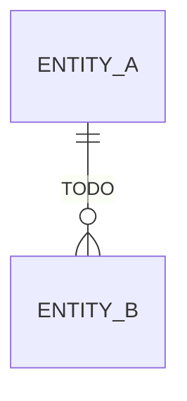

# Data Model — "Filing cabinet with strict labels that survives the office moving buildings"

> Persistence, schema, migrations

**Paths:** `app/db/**, app/models/**, alembic/**`

---

## Purpose

<!-- 2-3 sentences: what this section of the application does and why it exists. -->
<!-- Populated manually by the human, or auto-appended from verified /gabe-teach topics. -->

## Key Decisions

<!-- Load-bearing choices for this well. Each entry: date + one-line title + 1-2 paragraph rationale. -->

## Key Diagrams

<!-- Suggested diagram type for this well: erDiagram (picked by gabe-docs per-well heuristic) -->
<!-- Replace placeholder with a real diagram once the flow stabilizes. Keep ≤15 nodes. -->

## Topics (auto-appended)

<!-- /gabe-teach topics appends verified topic summaries here on first run. -->
<!-- Do not edit the structure below this line; edit individual entries freely. -->
