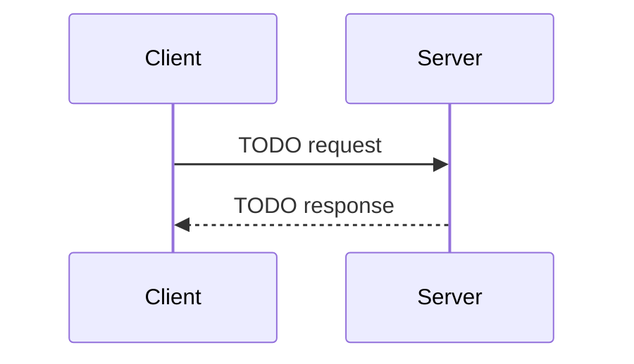

# Frontend — "Storefront glass — what users see and touch; the warehouse is elsewhere"

> React dashboard + submit form, API client

**Paths:** `frontend/src/**`

---

## Purpose

<!-- 2-3 sentences: what this section of the application does and why it exists. -->
<!-- Populated manually by the human, or auto-appended from verified /gabe-teach topics. -->

## Key Decisions

<!-- Load-bearing choices for this well. Each entry: date + one-line title + 1-2 paragraph rationale. -->

## Key Diagrams

<!-- Suggested diagram type for this well: sequenceDiagram (picked by gabe-docs per-well heuristic) -->
<!-- Replace placeholder with a real diagram once the flow stabilizes. Keep ≤15 nodes. -->

## Topics (auto-appended)

<!-- /gabe-teach topics appends verified topic summaries here on first run. -->
<!-- Do not edit the structure below this line; edit individual entries freely. -->

### T3 — Why duplicate guardrails client-side + typed SubmitState

**Class:** WHY  **Verified:** 2026-04-18  **Score:** 2/2  **Source:** working-tree (pre-commit)

**Files:**
- `frontend/src/pages/SubmitPage.tsx` (+249 -8)
- `frontend/src/lib/api.ts` (+24)

Replaced a placeholder submit page with a full form that mirrors the backend's `MAX_FILE_SIZE` + `ALLOWED_TYPES`, runs a client-side `validateFile()`, and tracks submission through a discriminated-union `SubmitState = idle | submitting | success | error`. The client is the UX layer; the server is the security authority. Duplicating the cheap policy checks on the client is bandwidth and latency optimization, not security redundancy — the server still re-checks every input because `curl` skips the client entirely. Leaving the rules only on the server means every rejectable upload pays a full round-trip before the user learns, which (for a 50MB file on a phone hotspot) costs real money and real seconds, and compounds when frustrated users retry "just in case."

**Key points:**
- Server asks "is this safe?"; client asks "is this worth sending?" — both answers are load-bearing, neither replaces the other.
- `SubmitState` as a discriminated union (not `{isLoading, error, incidentId}` flags) makes illegal states *unrepresentable* at the type level — `loading=true` + `incidentId=set` + `error=set` simultaneously is a compile error in the union and a production bug (stuck spinner or success-screen-with-spinner) in the flattened shape.
- `const SEVERITY_OPTIONS = [...] as const` gives the select a readonly tuple of literals so TypeScript can verify client options match the backend's `VALID_SEVERITY_HINTS` at compile time.
- Source-of-truth duplication has a cost: the client constants must track the server. This is a deliberate maintenance tradeoff, not an oversight — worth the round-trip savings for the happy path.
